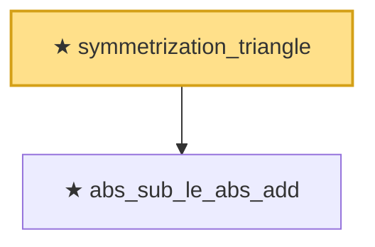

# Proof narrative — symmetrization_triangle

Root: **symmetrization_triangle** (theorem) `Statlib/EmpiricalProcess/Symmetrization.lean:180` · topic `EmpiricalProcess`
Closure: 2 declarations across 1 files. Generated from `proof_graph.json` — no files were moved.

Reading order (foundations first, headline last):

  ★ `abs_sub_le_abs_add` — private theorem · `Statlib/EmpiricalProcess/Symmetrization.lean:173`
★ `symmetrization_triangle` — theorem · `Statlib/EmpiricalProcess/Symmetrization.lean:180` **← headline**

## Dependency diagram

