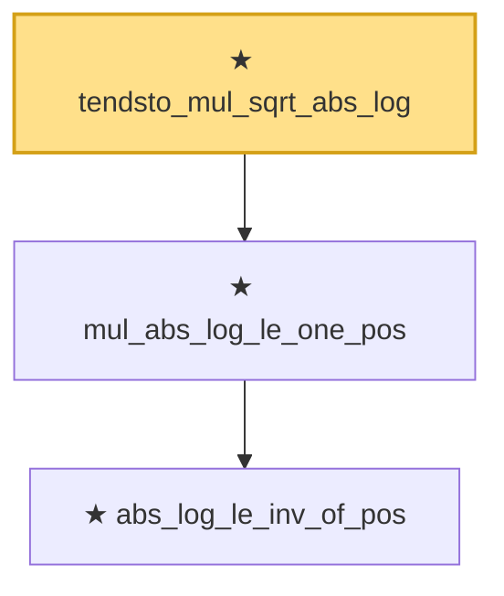

# Proof narrative — tendsto_mul_sqrt_abs_log

Root: **tendsto_mul_sqrt_abs_log** (theorem) `Statlib/EmpiricalProcess/Equicontinuity.lean:15` · topic `EmpiricalProcess`
Closure: 3 declarations across 1 files. Generated from `proof_graph.json` — no files were moved.

Reading order (foundations first, headline last):

    ★ `abs_log_le_inv_of_pos` — theorem · `Statlib/EmpiricalProcess/Equicontinuity.lean:6`
  ★ `mul_abs_log_le_one_pos` — theorem · `Statlib/EmpiricalProcess/Equicontinuity.lean:11`
★ `tendsto_mul_sqrt_abs_log` — theorem · `Statlib/EmpiricalProcess/Equicontinuity.lean:15` **← headline**

## Dependency diagram

