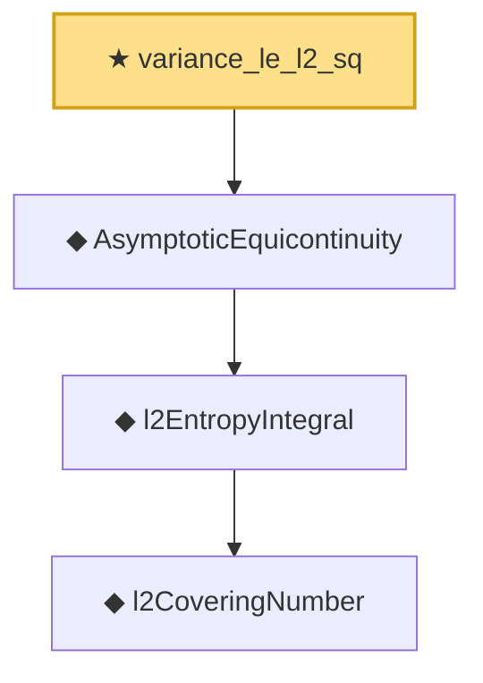

# Proof narrative — variance_le_l2_sq

Root: **variance_le_l2_sq** (theorem) `Statlib/EmpiricalProcess/Donsker.lean:216` · topic `EmpiricalProcess`
Closure: 4 declarations across 3 files. Generated from `proof_graph.json` — no files were moved.

Reading order (foundations first, headline last):

      ◆ `l2CoveringNumber` — def · `Statlib/EmpiricalProcess/DonskerInfra.lean:16`
    ◆ `l2EntropyIntegral` — def · `Statlib/EmpiricalProcess/DonskerInfra.lean:21`  _(also used by 2: donskerClass_of_entropy_bound, StrongDonskerClass)_
  ◆ `AsymptoticEquicontinuity` — def · `Statlib/EmpiricalProcess/Equicontinuity.lean:34`  _(also used by 2: DonskerAssumption7b, StrongDonskerClass)_
★ `variance_le_l2_sq` — theorem · `Statlib/EmpiricalProcess/Donsker.lean:216` **← headline**

## Dependency diagram

