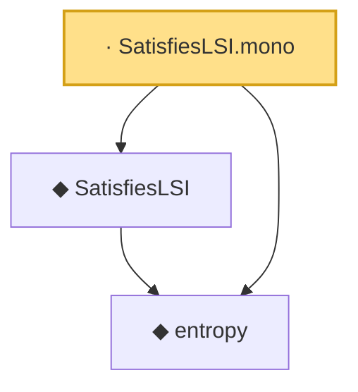

# Proof narrative — SatisfiesLSI.mono

Root: **SatisfiesLSI.mono** (lemma) `Statlib/Entropy/Basic.lean:233` · topic `Entropy`
Closure: 3 declarations across 1 files. Generated from `proof_graph.json` — no files were moved.

Reading order (foundations first, headline last):

  ◆ `entropy` — def · `Statlib/Entropy/Basic.lean:31`  _(also used by 21: condEntropyAt, entropy_eq_integral_mul_log_of_integral_eq_one, entropy_const, …)_
  ◆ `SatisfiesLSI` — def · `Statlib/Entropy/Basic.lean:42`  _(also used by 12: TensorizationLSIAt, SatisfiesLSI.apply, tensorization_lsi, …)_
· `SatisfiesLSI.mono` — lemma · `Statlib/Entropy/Basic.lean:233` **← headline**

## Dependency diagram

