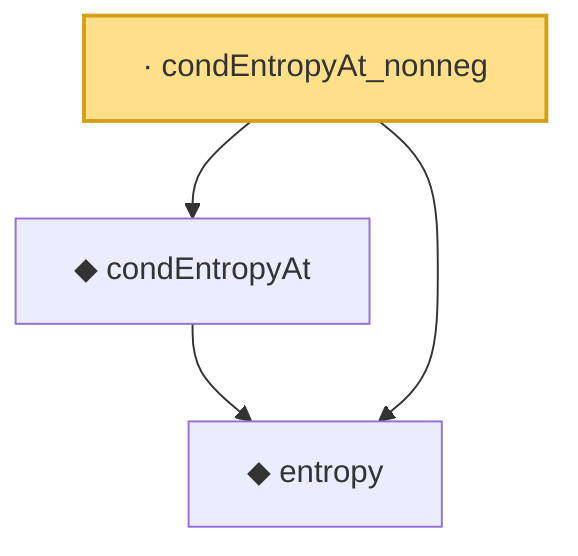

# Proof narrative — condEntropyAt_nonneg

Root: **condEntropyAt_nonneg** (lemma) `Statlib/Entropy/Basic.lean:187` · topic `Entropy`
Closure: 3 declarations across 1 files. Generated from `proof_graph.json` — no files were moved.

Reading order (foundations first, headline last):

  ◆ `entropy` — def · `Statlib/Entropy/Basic.lean:31`  _(also used by 21: SatisfiesLSI, entropy_eq_integral_mul_log_of_integral_eq_one, entropy_const, …)_
  ◆ `condEntropyAt` — def · `Statlib/Entropy/Basic.lean:77`  _(also used by 18: condEntropyAt_eq, condEntropyAt_le_of_satisfiesLSI, integrable_condEntropyAt_of_nonneg, …)_
· `condEntropyAt_nonneg` — lemma · `Statlib/Entropy/Basic.lean:187` **← headline**

## Dependency diagram

