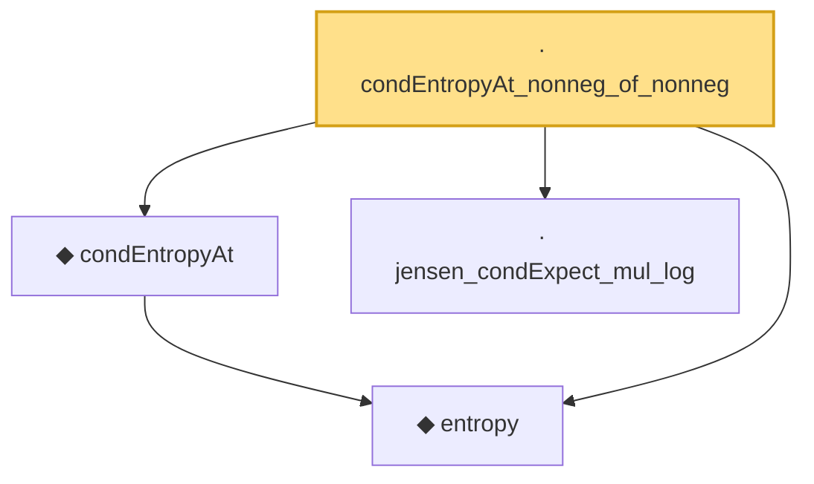

# Proof narrative — condEntropyAt_nonneg_of_nonneg

Root: **condEntropyAt_nonneg_of_nonneg** (private lemma) `Statlib/Entropy/LogSobolev.lean:3560` · topic `Entropy`
Closure: 4 declarations across 2 files. Generated from `proof_graph.json` — no files were moved.

Reading order (foundations first, headline last):

  ◆ `entropy` — def · `Statlib/Entropy/Basic.lean:31`  _(also used by 21: SatisfiesLSI, entropy_eq_integral_mul_log_of_integral_eq_one, entropy_const, …)_
  ◆ `condEntropyAt` — def · `Statlib/Entropy/Basic.lean:77`  _(also used by 18: condEntropyAt_eq, condEntropyAt_nonneg, condEntropyAt_le_of_satisfiesLSI, …)_
  · `jensen_condExpect_mul_log` — private lemma · `Statlib/Entropy/LogSobolev.lean:3541`  _(also used by 1: jensen_condExpect_integral_le)_
· `condEntropyAt_nonneg_of_nonneg` — private lemma · `Statlib/Entropy/LogSobolev.lean:3560` **← headline**

## Dependency diagram

