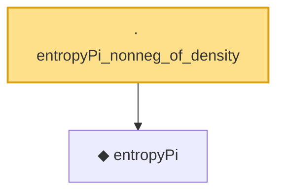

# Proof narrative — entropyPi_nonneg_of_density

Root: **entropyPi_nonneg_of_density** (lemma) `Statlib/Entropy/Basic.lean:171` · topic `Entropy`
Closure: 2 declarations across 1 files. Generated from `proof_graph.json` — no files were moved.

Reading order (foundations first, headline last):

  ◆ `entropyPi` — def · `Statlib/Entropy/Basic.lean:35`  _(also used by 19: TensorizationLSIAt, entropyPi_eq_integral_mul_log_of_integral_eq_one, entropyPi_const, …)_
· `entropyPi_nonneg_of_density` — lemma · `Statlib/Entropy/Basic.lean:171` **← headline**

## Dependency diagram

