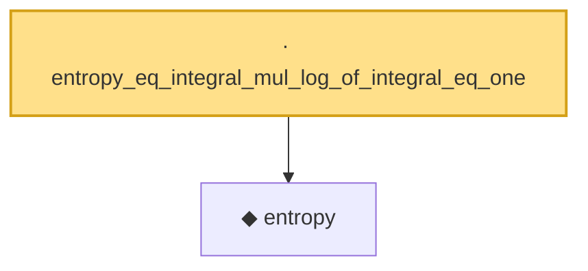

# Proof narrative — entropy_eq_integral_mul_log_of_integral_eq_one

Root: **entropy_eq_integral_mul_log_of_integral_eq_one** (lemma) `Statlib/Entropy/Basic.lean:103` · topic `Entropy`
Closure: 2 declarations across 1 files. Generated from `proof_graph.json` — no files were moved.

Reading order (foundations first, headline last):

  ◆ `entropy` — def · `Statlib/Entropy/Basic.lean:31`  _(also used by 22: SatisfiesLSI, condEntropyAt, entropy_const, …)_
· `entropy_eq_integral_mul_log_of_integral_eq_one` — lemma · `Statlib/Entropy/Basic.lean:103` **← headline**

## Dependency diagram

