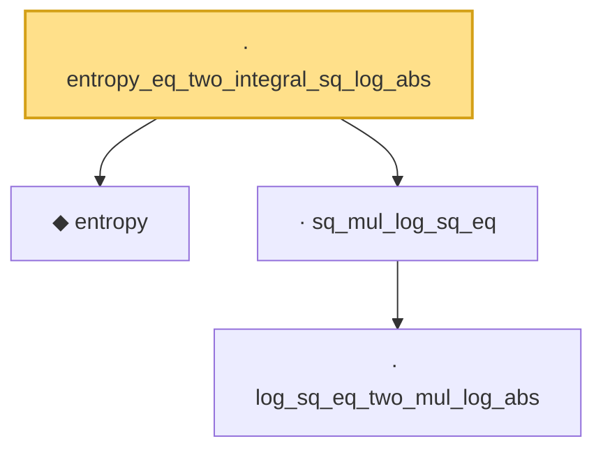

# Proof narrative — entropy_eq_two_integral_sq_log_abs

Root: **entropy_eq_two_integral_sq_log_abs** (lemma) `Statlib/Entropy/LogSobolev.lean:141` · topic `Entropy`
Closure: 4 declarations across 2 files. Generated from `proof_graph.json` — no files were moved.

Reading order (foundations first, headline last):

  ◆ `entropy` — def · `Statlib/Entropy/Basic.lean:31`  _(also used by 22: SatisfiesLSI, condEntropyAt, entropy_eq_integral_mul_log_of_integral_eq_one, …)_
    · `log_sq_eq_two_mul_log_abs` — lemma · `Statlib/Entropy/LogSobolev.lean:106`
  · `sq_mul_log_sq_eq` — lemma · `Statlib/Entropy/LogSobolev.lean:112`
· `entropy_eq_two_integral_sq_log_abs` — lemma · `Statlib/Entropy/LogSobolev.lean:141` **← headline**

## Dependency diagram

