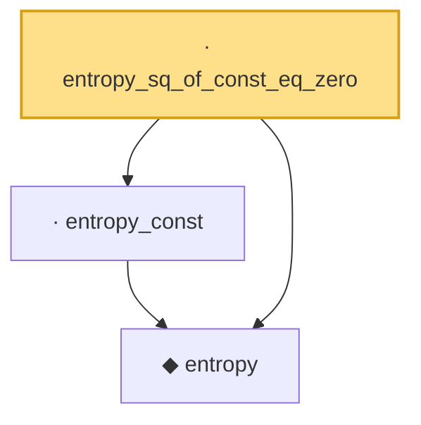

# Proof narrative — entropy_sq_of_const_eq_zero

Root: **entropy_sq_of_const_eq_zero** (lemma) `Statlib/Entropy/LogSobolev.lean:100` · topic `Entropy`
Closure: 3 declarations across 2 files. Generated from `proof_graph.json` — no files were moved.

Reading order (foundations first, headline last):

  ◆ `entropy` — def · `Statlib/Entropy/Basic.lean:31`  _(also used by 21: SatisfiesLSI, condEntropyAt, entropy_eq_integral_mul_log_of_integral_eq_one, …)_
  · `entropy_const` — lemma · `Statlib/Entropy/Basic.lean:116`
· `entropy_sq_of_const_eq_zero` — lemma · `Statlib/Entropy/LogSobolev.lean:100` **← headline**

## Dependency diagram

