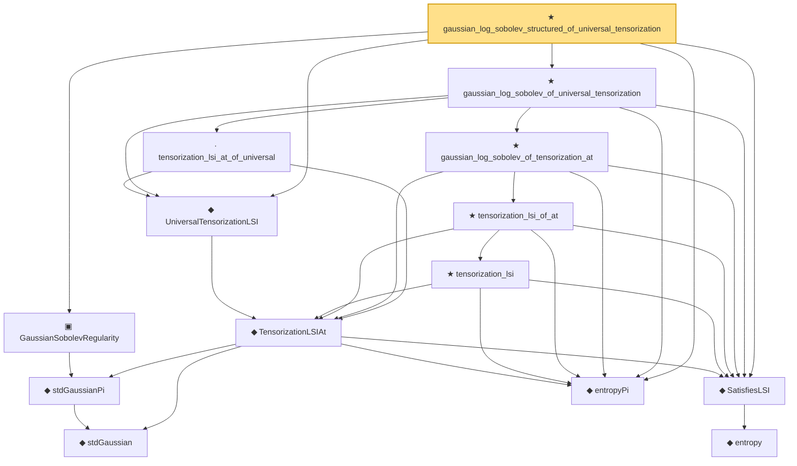

# Proof narrative — gaussian_log_sobolev_structured_of_universal_tensorization

Root: **gaussian_log_sobolev_structured_of_universal_tensorization** (theorem) `Statlib/Entropy/LogSobolev.lean:3109` · topic `Entropy`
Closure: 14 declarations across 3 files. Generated from `proof_graph.json` — no files were moved.

Reading order (foundations first, headline last):

      ◆ `stdGaussian` — abbrev · `Statlib/Gaussian/Basic.lean:29`  _(also used by 96: stdGaussianPi_absolutelyContinuous, integrable_mul_gaussianPDFReal_of_memLp, integrable_id_mul_mul_gaussianPDFReal_of_memLp, …)_
    ◆ `stdGaussianPi` — def · `Statlib/Gaussian/Basic.lean:32`  _(also used by 67: isProbabilityMeasure_stdGaussianPi, sigmaFinite_stdGaussianPi, stdGaussianPi_absolutelyContinuous, …)_
  ▣ `GaussianSobolevRegularity` — structure · `Statlib/Entropy/Basic.lean:68`  _(also used by 1: gaussian_log_sobolev_structured_of_tensorization_at)_
    ◆ `entropy` — def · `Statlib/Entropy/Basic.lean:31`  _(also used by 22: condEntropyAt, entropy_eq_integral_mul_log_of_integral_eq_one, entropy_const, …)_
  ◆ `SatisfiesLSI` — def · `Statlib/Entropy/Basic.lean:42`  _(also used by 7: SatisfiesLSI.mono, SatisfiesLSI.apply, gaussian_log_sobolev_structured_of_tensorization_at, …)_
  ◆ `entropyPi` — def · `Statlib/Entropy/Basic.lean:35`  _(also used by 14: entropyPi_eq_integral_mul_log_of_integral_eq_one, entropyPi_const, entropyPi_sq_eq, …)_
    ◆ `TensorizationLSIAt` — def · `Statlib/Entropy/Basic.lean:52`  _(also used by 2: gaussian_log_sobolev_structured_of_tensorization_at, tensorization_lsi_core)_
  ◆ `UniversalTensorizationLSI` — def · `Statlib/Entropy/Basic.lean:64`
        ★ `tensorization_lsi` — theorem · `Statlib/Entropy/LogSobolev.lean:3037`
      ★ `tensorization_lsi_of_at` — theorem · `Statlib/Entropy/LogSobolev.lean:3051`
    ★ `gaussian_log_sobolev_of_tensorization_at` — theorem · `Statlib/Entropy/LogSobolev.lean:3070`  _(also used by 2: gaussian_log_sobolev_structured_of_tensorization_at, gaussian_log_sobolev)_
    · `tensorization_lsi_at_of_universal` — lemma · `Statlib/Entropy/LogSobolev.lean:3065`
  ★ `gaussian_log_sobolev_of_universal_tensorization` — theorem · `Statlib/Entropy/LogSobolev.lean:3083`
★ `gaussian_log_sobolev_structured_of_universal_tensorization` — theorem · `Statlib/Entropy/LogSobolev.lean:3109` **← headline**

## Dependency diagram

