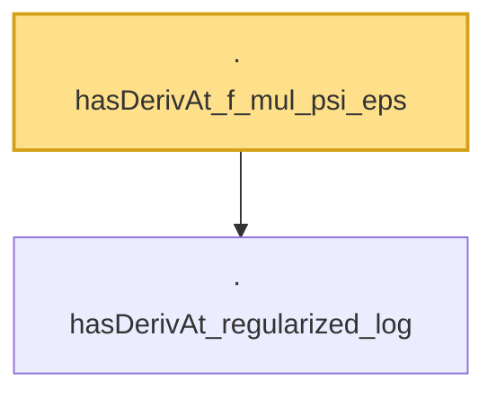

# Proof narrative — hasDerivAt_f_mul_psi_eps

Root: **hasDerivAt_f_mul_psi_eps** (lemma) `Statlib/Entropy/LogSobolev.lean:367` · topic `Entropy`
Closure: 2 declarations across 1 files. Generated from `proof_graph.json` — no files were moved.

Reading order (foundations first, headline last):

  · `hasDerivAt_regularized_log` — lemma · `Statlib/Entropy/LogSobolev.lean:342`
· `hasDerivAt_f_mul_psi_eps` — lemma · `Statlib/Entropy/LogSobolev.lean:367` **← headline**

## Dependency diagram

