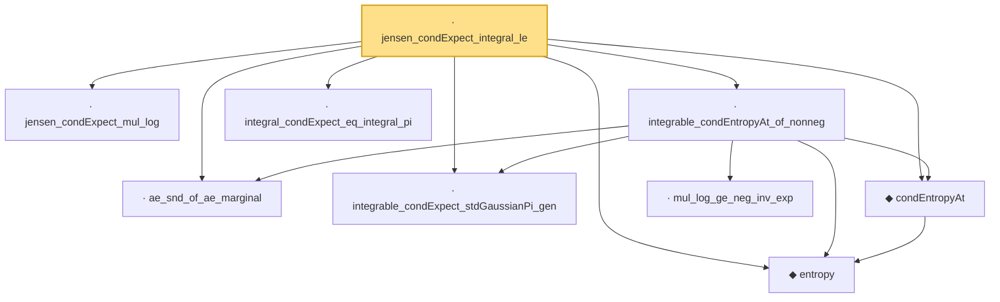

# Proof narrative — jensen_condExpect_integral_le

Root: **jensen_condExpect_integral_le** (private lemma) `Statlib/Entropy/LogSobolev.lean:3820` · topic `Entropy`
Closure: 9 declarations across 2 files. Generated from `proof_graph.json` — no files were moved.

Reading order (foundations first, headline last):

  · `ae_snd_of_ae_marginal` — private lemma · `Statlib/Entropy/LogSobolev.lean:3325`  _(also used by 1: entropy_convex_mixture)_
  · `jensen_condExpect_mul_log` — private lemma · `Statlib/Entropy/LogSobolev.lean:3541`  _(also used by 1: condEntropyAt_nonneg_of_nonneg)_
  · `integrable_condExpect_stdGaussianPi_gen` — private lemma · `Statlib/Entropy/LogSobolev.lean:3337`  _(also used by 2: entropy_convex_mixture, integrated_condEntropyAt_condExpect_le)_
  ◆ `entropy` — def · `Statlib/Entropy/Basic.lean:31`  _(also used by 20: SatisfiesLSI, entropy_eq_integral_mul_log_of_integral_eq_one, entropy_const, …)_
  ◆ `condEntropyAt` — def · `Statlib/Entropy/Basic.lean:77`  _(also used by 17: condEntropyAt_eq, condEntropyAt_nonneg, condEntropyAt_le_of_satisfiesLSI, …)_
    · `mul_log_ge_neg_inv_exp` — lemma · `Statlib/Entropy/LogSobolev.lean:3312`  _(also used by 2: entropy_convex_mixture, entropy_subadditivity_integrable)_
  · `integrable_condEntropyAt_of_nonneg` — private lemma · `Statlib/Entropy/LogSobolev.lean:3362`  _(also used by 2: integrated_condEntropyAt_condExpect_le, entropy_subadditivity_integrable)_
  · `integral_condExpect_eq_integral_pi` — private lemma · `Statlib/Entropy/LogSobolev.lean:3260`  _(also used by 5: integrated_condEntropyAt_eq, entropy_chain_rule_pi, integrated_condEntropyAt_condExpect_le, …)_
· `jensen_condExpect_integral_le` — private lemma · `Statlib/Entropy/LogSobolev.lean:3820` **← headline**

## Dependency diagram

