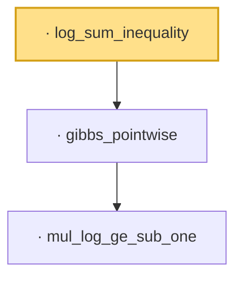

# Proof narrative — log_sum_inequality

Root: **log_sum_inequality** (private lemma) `Statlib/Entropy/LogSobolev.lean:3677` · topic `Entropy`
Closure: 3 declarations across 1 files. Generated from `proof_graph.json` — no files were moved.

Reading order (foundations first, headline last):

    · `mul_log_ge_sub_one` — lemma · `Statlib/Entropy/LogSobolev.lean:131`
  · `gibbs_pointwise` — private lemma · `Statlib/Entropy/LogSobolev.lean:3597`  _(also used by 1: log_sum_inequality_nn)_
· `log_sum_inequality` — private lemma · `Statlib/Entropy/LogSobolev.lean:3677` **← headline**

## Dependency diagram

