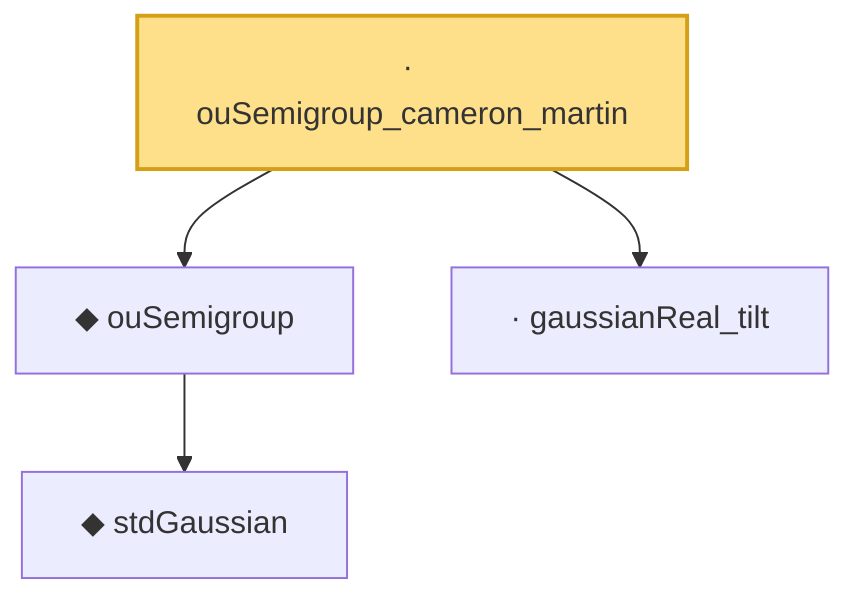

# Proof narrative — ouSemigroup_cameron_martin

Root: **ouSemigroup_cameron_martin** (private lemma) `Statlib/Entropy/LogSobolev.lean:1610` · topic `Entropy`
Closure: 4 declarations across 3 files. Generated from `proof_graph.json` — no files were moved.

Reading order (foundations first, headline last):

    ◆ `stdGaussian` — abbrev · `Statlib/Gaussian/Basic.lean:29`  _(also used by 97: TensorizationLSIAt, stdGaussianPi, stdGaussianPi_absolutelyContinuous, …)_
  ◆ `ouSemigroup` — def · `Statlib/Gaussian/OrnsteinUhlenbeck.lean:42`  _(also used by 35: ouSemigroup_bound_norm, ouSemigroup_stein_repr, ouSemigroup_hasSecondDeriv, …)_
  · `gaussianReal_tilt` — private lemma · `Statlib/Entropy/LogSobolev.lean:1596`
· `ouSemigroup_cameron_martin` — private lemma · `Statlib/Entropy/LogSobolev.lean:1610` **← headline**

## Dependency diagram

