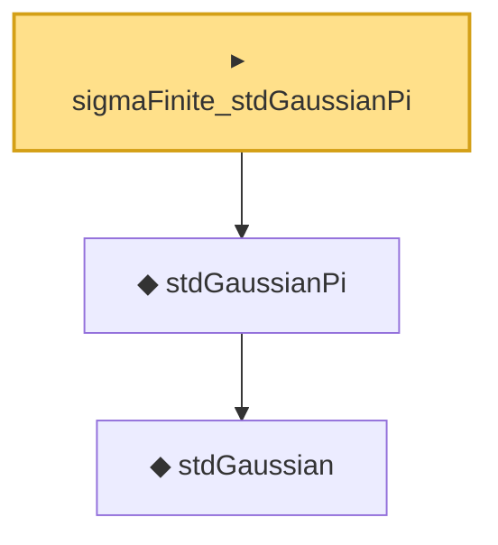

# Proof narrative — sigmaFinite_stdGaussianPi

Root: **sigmaFinite_stdGaussianPi** (instance) `Statlib/Entropy/Basic.lean:92` · topic `Entropy`
Closure: 3 declarations across 2 files. Generated from `proof_graph.json` — no files were moved.

Reading order (foundations first, headline last):

    ◆ `stdGaussian` — abbrev · `Statlib/Gaussian/Basic.lean:29`  _(also used by 97: TensorizationLSIAt, stdGaussianPi_absolutelyContinuous, integrable_mul_gaussianPDFReal_of_memLp, …)_
  ◆ `stdGaussianPi` — def · `Statlib/Gaussian/Basic.lean:32`  _(also used by 68: TensorizationLSIAt, GaussianSobolevRegularity, isProbabilityMeasure_stdGaussianPi, …)_
▸ `sigmaFinite_stdGaussianPi` — instance · `Statlib/Entropy/Basic.lean:92` **← headline**

## Dependency diagram

