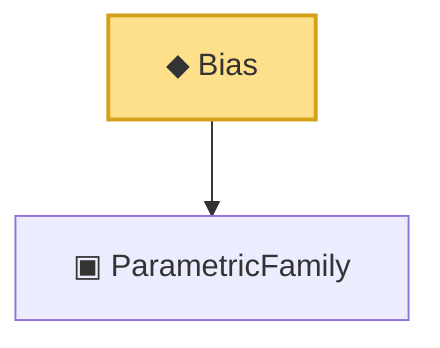

# Proof narrative — Bias

Root: **Bias** (noncomputable def) `Statlib/Estimator/Basic.lean:171` · topic `Estimator`
Closure: 2 declarations across 2 files. Generated from `proof_graph.json` — no files were moved.

Reading order (foundations first, headline last):

  ▣ `ParametricFamily` — structure · `Statlib/Statistic/Basic.lean:64`  _(also used by 46: CoverageProb, IsConfidenceInterval, IsConfidenceSet, …)_
◆ `Bias` — noncomputable def · `Statlib/Estimator/Basic.lean:171` **← headline**

## Dependency diagram

