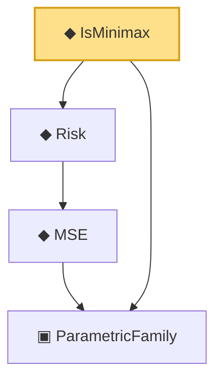

# Proof narrative — IsMinimax

Root: **IsMinimax** (def) `Statlib/Estimator/Basic.lean:214` · topic `Estimator`
Closure: 4 declarations across 2 files. Generated from `proof_graph.json` — no files were moved.

Reading order (foundations first, headline last):

  ▣ `ParametricFamily` — structure · `Statlib/Statistic/Basic.lean:64`  _(also used by 45: CoverageProb, IsConfidenceInterval, IsConfidenceSet, …)_
    ◆ `MSE` — noncomputable def · `Statlib/Estimator/Basic.lean:176`  _(also used by 7: mse_eq_variance_of_unbiased, IsEfficient, IsUMVUE, …)_
  ◆ `Risk` — noncomputable def · `Statlib/Estimator/Basic.lean:65`  _(also used by 7: IsAdmissible, BayesRisk, IsEquivalentRisk, …)_
◆ `IsMinimax` — def · `Statlib/Estimator/Basic.lean:214` **← headline**

## Dependency diagram

