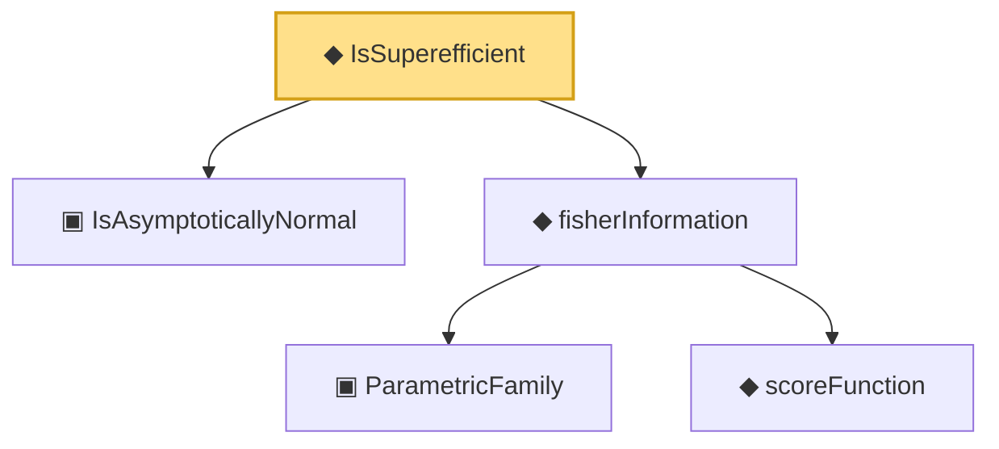

# Proof narrative — IsSuperefficient

Root: **IsSuperefficient** (def) `Statlib/Estimator/IsSuperefficient.lean:22` · topic `Estimator`
Closure: 5 declarations across 5 files. Generated from `proof_graph.json` — no files were moved.

Reading order (foundations first, headline last):

  ▣ `IsAsymptoticallyNormal` — structure · `Statlib/Estimator/IsAsymptoticallyNormal.lean:22`  _(also used by 3: IsAsymptoticallyEfficient, IsMLEAsymptoticallyNormal, clt_isAsymptoticallyNormal)_
    ▣ `ParametricFamily` — structure · `Statlib/Statistic/Basic.lean:64`  _(also used by 46: CoverageProb, IsConfidenceInterval, IsConfidenceSet, …)_
    ◆ `scoreFunction` — noncomputable def · `Statlib/Information/scoreFunction.lean:12`  _(also used by 2: cramer_rao, expFamily_score_eq)_
  ◆ `fisherInformation` — noncomputable def · `Statlib/Information/fisherInformation.lean:12`  _(also used by 8: IsEfficient, IsAsymptoticallyEfficient, IsMLEAsymptoticallyNormal, …)_
◆ `IsSuperefficient` — def · `Statlib/Estimator/IsSuperefficient.lean:22` **← headline**

## Dependency diagram

