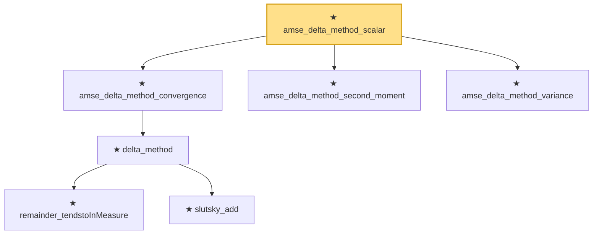

# Proof narrative — amse_delta_method_scalar

Root: **amse_delta_method_scalar** (theorem) `Statlib/Estimator/amse_delta_method_scalar.lean:36` · topic `Estimator`
Closure: 7 declarations across 7 files. Generated from `proof_graph.json` — no files were moved.

Reading order (foundations first, headline last):

      ★ `remainder_tendstoInMeasure` — theorem · `Statlib/LimitTheorems/remainder_tendstoInMeasure.lean:20`
      ★ `slutsky_add` — theorem · `Statlib/LimitTheorems/slutsky_add.lean:16`
    ★ `delta_method` — theorem · `Statlib/LimitTheorems/delta_method.lean:24`  _(also used by 1: delta_method_sqrt_n)_
  ★ `amse_delta_method_convergence` — theorem · `Statlib/Estimator/amse_delta_method_convergence.lean:22`
  ★ `amse_delta_method_second_moment` — theorem · `Statlib/Estimator/amse_delta_method_second_moment.lean:24`
  ★ `amse_delta_method_variance` — theorem · `Statlib/Estimator/amse_delta_method_variance.lean:24`
★ `amse_delta_method_scalar` — theorem · `Statlib/Estimator/amse_delta_method_scalar.lean:36` **← headline**

## Dependency diagram

