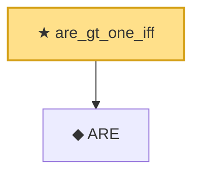

# Proof narrative — are_gt_one_iff

Root: **are_gt_one_iff** (theorem) `Statlib/Estimator/are_gt_one_iff.lean:17` · topic `Estimator`
Closure: 2 declarations across 2 files. Generated from `proof_graph.json` — no files were moved.

Reading order (foundations first, headline last):

  ◆ `ARE` — def · `Statlib/Estimator/ARE.lean:17`  _(also used by 1: are_inv)_
★ `are_gt_one_iff` — theorem · `Statlib/Estimator/are_gt_one_iff.lean:17` **← headline**

## Dependency diagram

