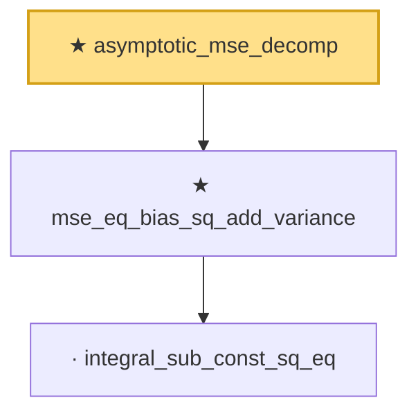

# Proof narrative — asymptotic_mse_decomp

Root: **asymptotic_mse_decomp** (theorem) `Statlib/Estimator/asymptotic_mse_decomp.lean:19` · topic `Estimator`
Closure: 3 declarations across 3 files. Generated from `proof_graph.json` — no files were moved.

Reading order (foundations first, headline last):

    · `integral_sub_const_sq_eq` — lemma · `Statlib/Variance/integral_sub_const_sq_eq.lean:11`  _(also used by 1: rb_mse_decomposition)_
  ★ `mse_eq_bias_sq_add_variance` — theorem · `Statlib/Estimator/Basic.lean:80`  _(also used by 1: mse_eq_variance_of_unbiased)_
★ `asymptotic_mse_decomp` — theorem · `Statlib/Estimator/asymptotic_mse_decomp.lean:19` **← headline**

## Dependency diagram

