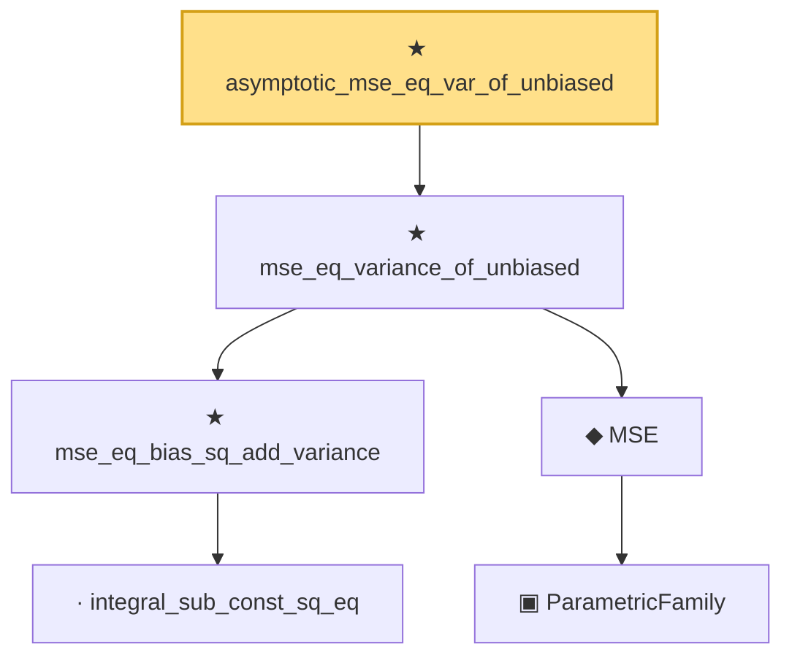

# Proof narrative — asymptotic_mse_eq_var_of_unbiased

Root: **asymptotic_mse_eq_var_of_unbiased** (theorem) `Statlib/Estimator/asymptotic_mse_eq_var_of_unbiased.lean:16` · topic `Estimator`
Closure: 6 declarations across 4 files. Generated from `proof_graph.json` — no files were moved.

Reading order (foundations first, headline last):

      · `integral_sub_const_sq_eq` — lemma · `Statlib/Variance/integral_sub_const_sq_eq.lean:11`  _(also used by 1: rb_mse_decomposition)_
    ★ `mse_eq_bias_sq_add_variance` — theorem · `Statlib/Estimator/Basic.lean:80`  _(also used by 1: asymptotic_mse_decomp)_
      ▣ `ParametricFamily` — structure · `Statlib/Statistic/Basic.lean:64`  _(also used by 46: CoverageProb, IsConfidenceInterval, IsConfidenceSet, …)_
    ◆ `MSE` — noncomputable def · `Statlib/Estimator/Basic.lean:176`  _(also used by 7: Risk, IsEfficient, IsUMVUE, …)_
  ★ `mse_eq_variance_of_unbiased` — theorem · `Statlib/Estimator/Basic.lean:89`
★ `asymptotic_mse_eq_var_of_unbiased` — theorem · `Statlib/Estimator/asymptotic_mse_eq_var_of_unbiased.lean:16` **← headline**

## Dependency diagram

