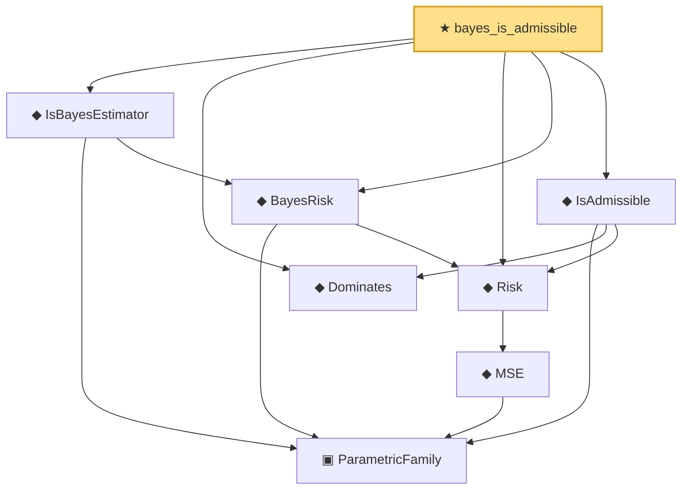

# Proof narrative — bayes_is_admissible

Root: **bayes_is_admissible** (theorem) `Statlib/Estimator/bayes_is_admissible.lean:18` · topic `Estimator`
Closure: 8 declarations across 3 files. Generated from `proof_graph.json` — no files were moved.

Reading order (foundations first, headline last):

    ▣ `ParametricFamily` — structure · `Statlib/Statistic/Basic.lean:64`  _(also used by 43: CoverageProb, IsConfidenceInterval, IsConfidenceSet, …)_
        ◆ `MSE` — noncomputable def · `Statlib/Estimator/Basic.lean:176`  _(also used by 7: mse_eq_variance_of_unbiased, IsEfficient, IsUMVUE, …)_
  ◆ `Risk` — noncomputable def · `Statlib/Estimator/Basic.lean:65`  _(also used by 5: IsMinimax, IsEquivalentRisk, IsOptimal, …)_
  ◆ `BayesRisk` — noncomputable def · `Statlib/Estimator/Basic.lean:222`  _(also used by 1: constant_risk_bayes_is_minimax)_
  ◆ `IsBayesEstimator` — def · `Statlib/Estimator/Basic.lean:229`  _(also used by 1: constant_risk_bayes_is_minimax)_
  ◆ `Dominates` — def · `Statlib/Estimator/Basic.lean:49`
  ◆ `IsAdmissible` — def · `Statlib/Estimator/Basic.lean:206`  _(also used by 3: IsOptimal.isAdmissible, IsOptimal.admissible_isOptimal_and_equivalent, no_optimal_of_two_admissible_not_equivalent)_
★ `bayes_is_admissible` — theorem · `Statlib/Estimator/bayes_is_admissible.lean:18` **← headline**

## Dependency diagram

