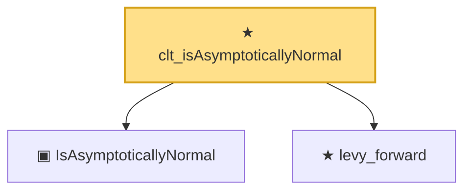

# Proof narrative — clt_isAsymptoticallyNormal

Root: **clt_isAsymptoticallyNormal** (theorem) `Statlib/Estimator/clt_isAsymptoticallyNormal.lean:22` · topic `Estimator`
Closure: 3 declarations across 3 files. Generated from `proof_graph.json` — no files were moved.

Reading order (foundations first, headline last):

  ▣ `IsAsymptoticallyNormal` — structure · `Statlib/Estimator/IsAsymptoticallyNormal.lean:22`  _(also used by 3: IsAsymptoticallyEfficient, IsMLEAsymptoticallyNormal, IsSuperefficient)_
  ★ `levy_forward` — theorem · `Statlib/LimitTheorems/levy_forward.lean:20`  _(also used by 3: charFun_eq_of_subseq, cramer_wold_reverse, ustatistic_clt_nondegenerate)_
★ `clt_isAsymptoticallyNormal` — theorem · `Statlib/Estimator/clt_isAsymptoticallyNormal.lean:22` **← headline**

## Dependency diagram

