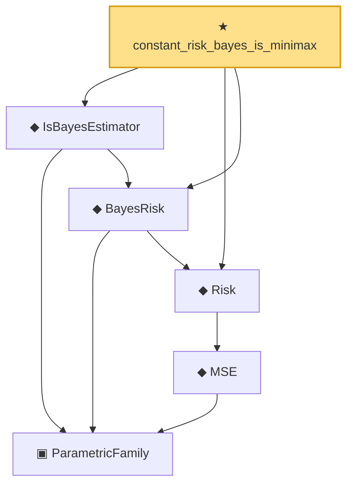

# Proof narrative — constant_risk_bayes_is_minimax

Root: **constant_risk_bayes_is_minimax** (theorem) `Statlib/Estimator/constant_risk_bayes_is_minimax.lean:17` · topic `Estimator`
Closure: 6 declarations across 3 files. Generated from `proof_graph.json` — no files were moved.

Reading order (foundations first, headline last):

    ▣ `ParametricFamily` — structure · `Statlib/Statistic/Basic.lean:64`  _(also used by 44: CoverageProb, IsConfidenceInterval, IsConfidenceSet, …)_
        ◆ `MSE` — noncomputable def · `Statlib/Estimator/Basic.lean:176`  _(also used by 7: mse_eq_variance_of_unbiased, IsEfficient, IsUMVUE, …)_
  ◆ `Risk` — noncomputable def · `Statlib/Estimator/Basic.lean:65`  _(also used by 6: IsAdmissible, IsMinimax, IsEquivalentRisk, …)_
  ◆ `BayesRisk` — noncomputable def · `Statlib/Estimator/Basic.lean:222`  _(also used by 1: bayes_is_admissible)_
  ◆ `IsBayesEstimator` — def · `Statlib/Estimator/Basic.lean:229`  _(also used by 1: bayes_is_admissible)_
★ `constant_risk_bayes_is_minimax` — theorem · `Statlib/Estimator/constant_risk_bayes_is_minimax.lean:17` **← headline**

## Dependency diagram

