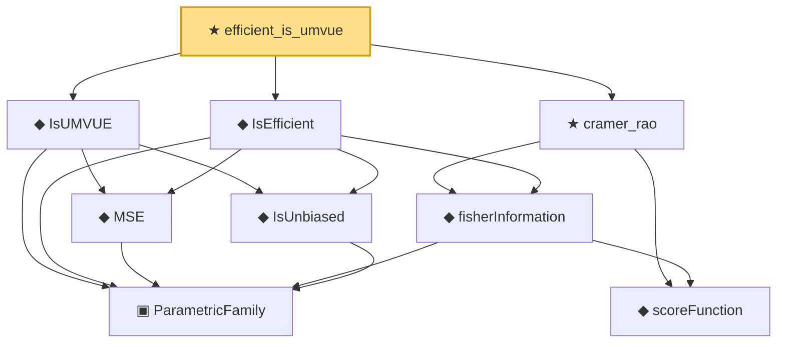

# Proof narrative — efficient_is_umvue

Root: **efficient_is_umvue** (theorem) `Statlib/Estimator/efficient_is_umvue.lean:18` · topic `Estimator`
Closure: 9 declarations across 6 files. Generated from `proof_graph.json` — no files were moved.

Reading order (foundations first, headline last):

    ▣ `ParametricFamily` — structure · `Statlib/Statistic/Basic.lean:64`  _(also used by 42: CoverageProb, IsConfidenceInterval, IsConfidenceSet, …)_
    ◆ `IsUnbiased` — def · `Statlib/Statistic/Basic.lean:93`  _(also used by 1: lehmann_scheffe)_
    ◆ `scoreFunction` — noncomputable def · `Statlib/Information/scoreFunction.lean:12`  _(also used by 1: expFamily_score_eq)_
    ◆ `fisherInformation` — noncomputable def · `Statlib/Information/fisherInformation.lean:12`  _(also used by 7: IsAsymptoticallyEfficient, IsMLEAsymptoticallyNormal, IsSuperefficient, …)_
    ◆ `MSE` — noncomputable def · `Statlib/Estimator/Basic.lean:176`  _(also used by 6: Risk, mse_eq_variance_of_unbiased, expfamily_umvue, …)_
  ◆ `IsEfficient` — def · `Statlib/Estimator/Basic.lean:316`
  ◆ `IsUMVUE` — def · `Statlib/Estimator/Basic.lean:327`  _(also used by 5: expfamily_umvue, rao_blackwell_umvue, umvue_ae_unique, …)_
  ★ `cramer_rao` — theorem · `Statlib/Information/CramerRao.lean:22`
★ `efficient_is_umvue` — theorem · `Statlib/Estimator/efficient_is_umvue.lean:18` **← headline**

## Dependency diagram

