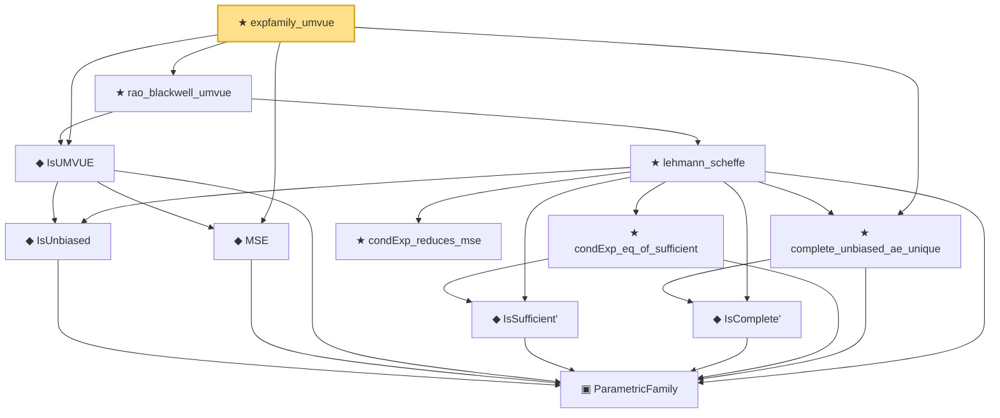

# Proof narrative — expfamily_umvue

Root: **expfamily_umvue** (theorem) `Statlib/Estimator/expfamily_umvue.lean:20` · topic `Estimator`
Closure: 12 declarations across 8 files. Generated from `proof_graph.json` — no files were moved.

Reading order (foundations first, headline last):

    ▣ `ParametricFamily` — structure · `Statlib/Statistic/Basic.lean:64`  _(also used by 39: CoverageProb, IsConfidenceInterval, IsConfidenceSet, …)_
    ◆ `IsUnbiased` — def · `Statlib/Statistic/Basic.lean:93`  _(also used by 1: IsEfficient)_
  ◆ `MSE` — noncomputable def · `Statlib/Estimator/Basic.lean:176`  _(also used by 6: Risk, mse_eq_variance_of_unbiased, IsEfficient, …)_
  ◆ `IsUMVUE` — def · `Statlib/Estimator/Basic.lean:327`  _(also used by 4: efficient_is_umvue, umvue_ae_unique, umvue_iff_orthogonal_to_sufficient_unbiasedOfZero, …)_
      ◆ `IsSufficient'` — def · `Statlib/Statistic/Basic.lean:83`  _(also used by 2: IsMinimalSufficient', minimalSufficient_of_subfamily)_
      ◆ `IsComplete'` — def · `Statlib/Statistic/Basic.lean:69`
      ★ `condExp_eq_of_sufficient` — theorem · `Statlib/Sufficiency/condExp_eq_of_sufficient.lean:18`  _(also used by 2: umvue_iff_orthogonal_to_sufficient_unbiasedOfZero, unestimable_of_complete_no_function)_
      ★ `condExp_reduces_mse` — theorem · `Statlib/Sufficiency/condExp_reduces_mse.lean:20`
  ★ `complete_unbiased_ae_unique` — theorem · `Statlib/Sufficiency/complete_unbiased_ae_unique.lean:16`
    ★ `lehmann_scheffe` — theorem · `Statlib/Sufficiency/lehmann_scheffe.lean:29`  _(also used by 1: blue_is_umvue)_
  ★ `rao_blackwell_umvue` — theorem · `Statlib/Estimator/rao_blackwell_umvue.lean:16`
★ `expfamily_umvue` — theorem · `Statlib/Estimator/expfamily_umvue.lean:20` **← headline**

## Dependency diagram

