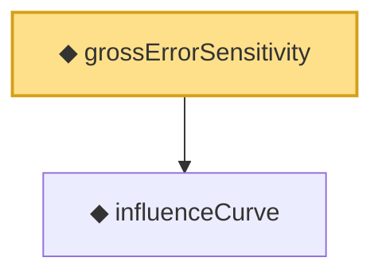

# Proof narrative — grossErrorSensitivity

Root: **grossErrorSensitivity** (noncomputable def) `Statlib/Estimator/grossErrorSensitivity.lean:14` · topic `Estimator`
Closure: 2 declarations across 2 files. Generated from `proof_graph.json` — no files were moved.

Reading order (foundations first, headline last):

  ◆ `influenceCurve` — noncomputable def · `Statlib/Estimator/influenceCurve.lean:14`
◆ `grossErrorSensitivity` — noncomputable def · `Statlib/Estimator/grossErrorSensitivity.lean:14` **← headline**

## Dependency diagram

