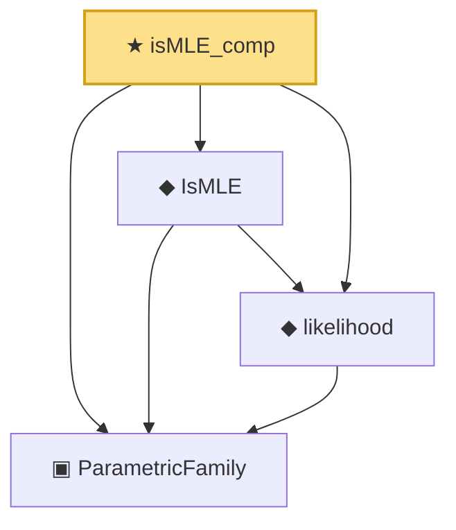

# Proof narrative — isMLE_comp

Root: **isMLE_comp** (theorem) `Statlib/Estimator/Basic.lean:136` · topic `Estimator`
Closure: 4 declarations across 2 files. Generated from `proof_graph.json` — no files were moved.

Reading order (foundations first, headline last):

  ▣ `ParametricFamily` — structure · `Statlib/Statistic/Basic.lean:64`  _(also used by 44: CoverageProb, IsConfidenceInterval, IsConfidenceSet, …)_
  ◆ `likelihood` — noncomputable def · `Statlib/Estimator/Basic.lean:117`
  ◆ `IsMLE` — def · `Statlib/Estimator/Basic.lean:124`
★ `isMLE_comp` — theorem · `Statlib/Estimator/Basic.lean:136` **← headline**

## Dependency diagram

