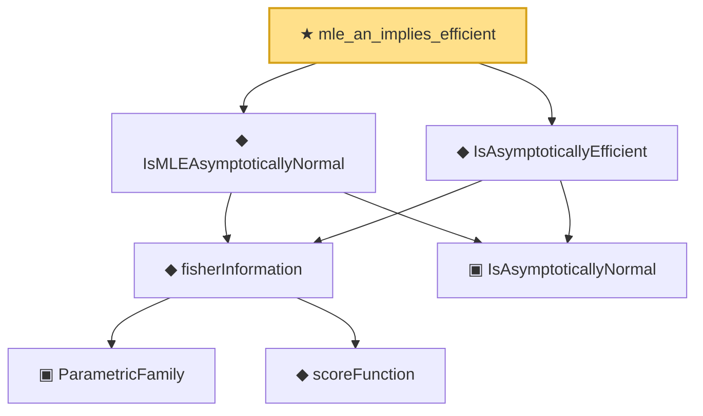

# Proof narrative — mle_an_implies_efficient

Root: **mle_an_implies_efficient** (theorem) `Statlib/Estimator/mle_an_implies_efficient.lean:22` · topic `Estimator`
Closure: 7 declarations across 7 files. Generated from `proof_graph.json` — no files were moved.

Reading order (foundations first, headline last):

      ▣ `ParametricFamily` — structure · `Statlib/Statistic/Basic.lean:64`  _(also used by 46: CoverageProb, IsConfidenceInterval, IsConfidenceSet, …)_
      ◆ `scoreFunction` — noncomputable def · `Statlib/Information/scoreFunction.lean:12`  _(also used by 2: cramer_rao, expFamily_score_eq)_
    ◆ `fisherInformation` — noncomputable def · `Statlib/Information/fisherInformation.lean:12`  _(also used by 7: IsEfficient, IsSuperefficient, expFamily_fisherInformation_mean_param_eq_inv_variance, …)_
    ▣ `IsAsymptoticallyNormal` — structure · `Statlib/Estimator/IsAsymptoticallyNormal.lean:22`  _(also used by 2: IsSuperefficient, clt_isAsymptoticallyNormal)_
  ◆ `IsMLEAsymptoticallyNormal` — def · `Statlib/Estimator/IsMLEAsymptoticallyNormal.lean:22`
  ◆ `IsAsymptoticallyEfficient` — def · `Statlib/Estimator/IsAsymptoticallyEfficient.lean:22`
★ `mle_an_implies_efficient` — theorem · `Statlib/Estimator/mle_an_implies_efficient.lean:22` **← headline**

## Dependency diagram

