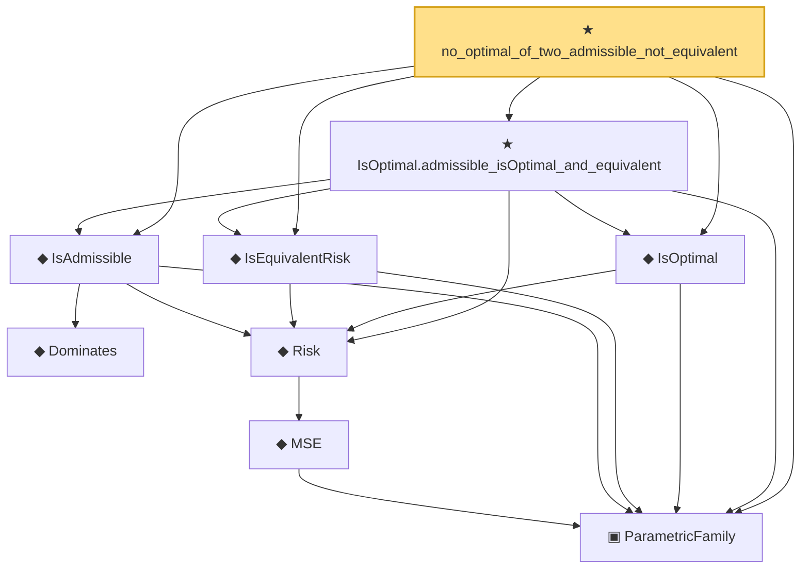

# Proof narrative — no_optimal_of_two_admissible_not_equivalent

Root: **no_optimal_of_two_admissible_not_equivalent** (theorem) `Statlib/Estimator/Basic.lean:292` · topic `Estimator`
Closure: 9 declarations across 2 files. Generated from `proof_graph.json` — no files were moved.

Reading order (foundations first, headline last):

  ▣ `ParametricFamily` — structure · `Statlib/Statistic/Basic.lean:64`  _(also used by 41: CoverageProb, IsConfidenceInterval, IsConfidenceSet, …)_
    ◆ `Dominates` — def · `Statlib/Estimator/Basic.lean:49`  _(also used by 1: bayes_is_admissible)_
      ◆ `MSE` — noncomputable def · `Statlib/Estimator/Basic.lean:176`  _(also used by 7: mse_eq_variance_of_unbiased, IsEfficient, IsUMVUE, …)_
    ◆ `Risk` — noncomputable def · `Statlib/Estimator/Basic.lean:65`  _(also used by 4: IsMinimax, BayesRisk, bayes_is_admissible, …)_
  ◆ `IsAdmissible` — def · `Statlib/Estimator/Basic.lean:206`  _(also used by 2: IsOptimal.isAdmissible, bayes_is_admissible)_
  ◆ `IsEquivalentRisk` — def · `Statlib/Estimator/Basic.lean:238`
  ◆ `IsOptimal` — def · `Statlib/Estimator/Basic.lean:244`  _(also used by 1: IsOptimal.isAdmissible)_
  ★ `IsOptimal.admissible_isOptimal_and_equivalent` — theorem · `Statlib/Estimator/Basic.lean:260`
★ `no_optimal_of_two_admissible_not_equivalent` — theorem · `Statlib/Estimator/Basic.lean:292` **← headline**

## Dependency diagram

