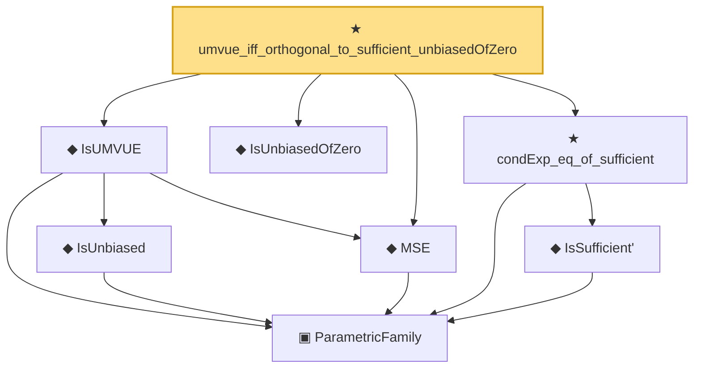

# Proof narrative — umvue_iff_orthogonal_to_sufficient_unbiasedOfZero

Root: **umvue_iff_orthogonal_to_sufficient_unbiasedOfZero** (theorem) `Statlib/Estimator/umvue_iff_orthogonal_to_sufficient_unbiasedOfZero.lean:30` · topic `Estimator`
Closure: 8 declarations across 5 files. Generated from `proof_graph.json` — no files were moved.

Reading order (foundations first, headline last):

    ▣ `ParametricFamily` — structure · `Statlib/Statistic/Basic.lean:64`  _(also used by 42: CoverageProb, IsConfidenceInterval, IsConfidenceSet, …)_
    ◆ `IsUnbiased` — def · `Statlib/Statistic/Basic.lean:93`  _(also used by 2: IsEfficient, lehmann_scheffe)_
  ◆ `MSE` — noncomputable def · `Statlib/Estimator/Basic.lean:176`  _(also used by 6: Risk, mse_eq_variance_of_unbiased, IsEfficient, …)_
  ◆ `IsUMVUE` — def · `Statlib/Estimator/Basic.lean:327`  _(also used by 5: efficient_is_umvue, expfamily_umvue, rao_blackwell_umvue, …)_
  ◆ `IsUnbiasedOfZero` — def · `Statlib/Estimator/IsUnbiasedOfZero.lean:17`  _(also used by 1: umvue_iff_orthogonal_to_unbiasedOfZero)_
    ◆ `IsSufficient'` — def · `Statlib/Statistic/Basic.lean:83`  _(also used by 3: IsMinimalSufficient', lehmann_scheffe, minimalSufficient_of_subfamily)_
  ★ `condExp_eq_of_sufficient` — theorem · `Statlib/Sufficiency/condExp_eq_of_sufficient.lean:18`  _(also used by 2: unestimable_of_complete_no_function, lehmann_scheffe)_
★ `umvue_iff_orthogonal_to_sufficient_unbiasedOfZero` — theorem · `Statlib/Estimator/umvue_iff_orthogonal_to_sufficient_unbiasedOfZero.lean:30` **← headline**

## Dependency diagram

