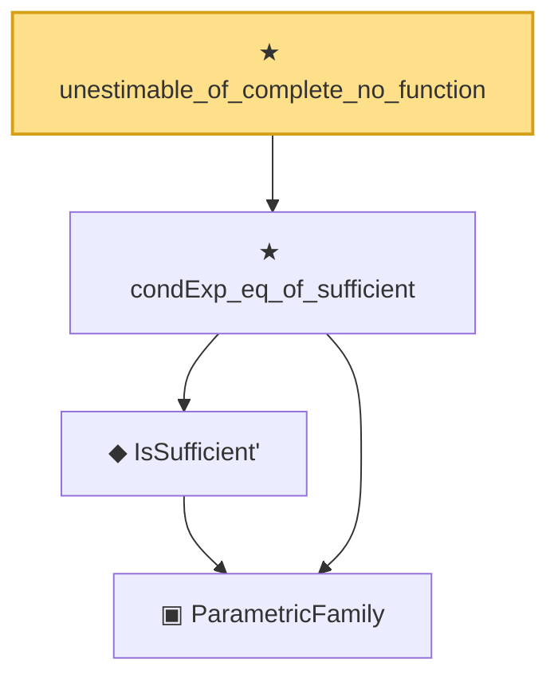

# Proof narrative — unestimable_of_complete_no_function

Root: **unestimable_of_complete_no_function** (theorem) `Statlib/Estimator/unestimable_of_complete_no_function.lean:21` · topic `Estimator`
Closure: 4 declarations across 3 files. Generated from `proof_graph.json` — no files were moved.

Reading order (foundations first, headline last):

    ▣ `ParametricFamily` — structure · `Statlib/Statistic/Basic.lean:64`  _(also used by 45: CoverageProb, IsConfidenceInterval, IsConfidenceSet, …)_
    ◆ `IsSufficient'` — def · `Statlib/Statistic/Basic.lean:83`  _(also used by 3: IsMinimalSufficient', lehmann_scheffe, minimalSufficient_of_subfamily)_
  ★ `condExp_eq_of_sufficient` — theorem · `Statlib/Sufficiency/condExp_eq_of_sufficient.lean:18`  _(also used by 2: umvue_iff_orthogonal_to_sufficient_unbiasedOfZero, lehmann_scheffe)_
★ `unestimable_of_complete_no_function` — theorem · `Statlib/Estimator/unestimable_of_complete_no_function.lean:21` **← headline**

## Dependency diagram

