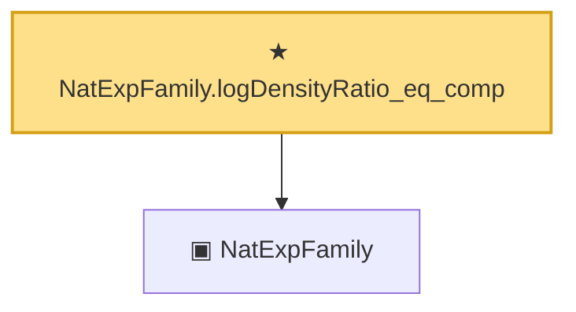

# Proof narrative — NatExpFamily.logDensityRatio_eq_comp

Root: **NatExpFamily.logDensityRatio_eq_comp** (theorem) `Statlib/ExpFamily/Basic.lean:104` · topic `ExpFamily`
Closure: 2 declarations across 1 files. Generated from `proof_graph.json` — no files were moved.

Reading order (foundations first, headline last):

  ▣ `NatExpFamily` — structure · `Statlib/ExpFamily/Basic.lean:71`  _(also used by 4: expFamily_mle_eq_sufficient_stat, NatExpFamily.logDensityRatio, NatExpFamily.logDensityRatio_factors, …)_
★ `NatExpFamily.logDensityRatio_eq_comp` — theorem · `Statlib/ExpFamily/Basic.lean:104` **← headline**

## Dependency diagram

