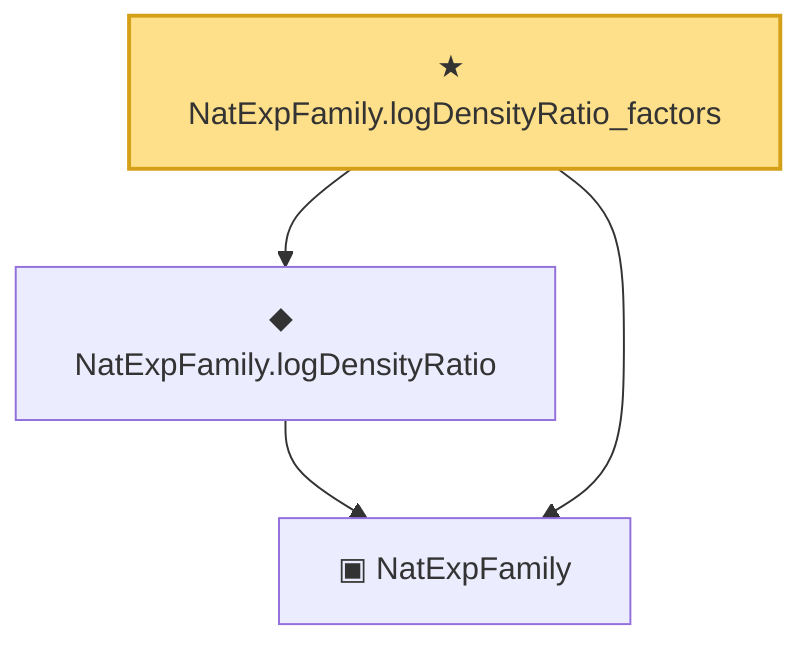

# Proof narrative — NatExpFamily.logDensityRatio_factors

Root: **NatExpFamily.logDensityRatio_factors** (theorem) `Statlib/ExpFamily/Basic.lean:92` · topic `ExpFamily`
Closure: 3 declarations across 1 files. Generated from `proof_graph.json` — no files were moved.

Reading order (foundations first, headline last):

  ▣ `NatExpFamily` — structure · `Statlib/ExpFamily/Basic.lean:71`  _(also used by 3: expFamily_mle_eq_sufficient_stat, NatExpFamily.logDensityRatioViaT, NatExpFamily.logDensityRatio_eq_comp)_
  ◆ `NatExpFamily.logDensityRatio` — def · `Statlib/ExpFamily/Basic.lean:87`
★ `NatExpFamily.logDensityRatio_factors` — theorem · `Statlib/ExpFamily/Basic.lean:92` **← headline**

## Dependency diagram

