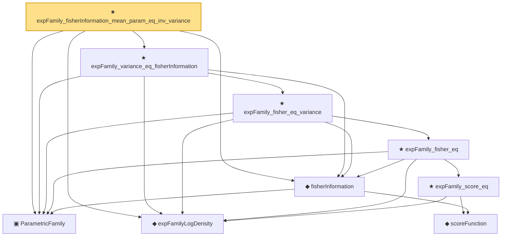

# Proof narrative — expFamily_fisherInformation_mean_param_eq_inv_variance

Root: **expFamily_fisherInformation_mean_param_eq_inv_variance** (theorem) `Statlib/ExpFamily/expFamily_fisherInformation_mean_param_eq_inv_variance.lean:33` · topic `ExpFamily`
Closure: 9 declarations across 9 files. Generated from `proof_graph.json` — no files were moved.

Reading order (foundations first, headline last):

  ▣ `ParametricFamily` — structure · `Statlib/Statistic/Basic.lean:64`  _(also used by 42: CoverageProb, IsConfidenceInterval, IsConfidenceSet, …)_
    ◆ `scoreFunction` — noncomputable def · `Statlib/Information/scoreFunction.lean:12`  _(also used by 1: cramer_rao)_
  ◆ `fisherInformation` — noncomputable def · `Statlib/Information/fisherInformation.lean:12`  _(also used by 5: IsEfficient, IsAsymptoticallyEfficient, IsMLEAsymptoticallyNormal, …)_
  ◆ `expFamilyLogDensity` — noncomputable def · `Statlib/Information/expFamilyLogDensity.lean:13`
        ★ `expFamily_score_eq` — theorem · `Statlib/Information/expFamily_score_eq.lean:16`
      ★ `expFamily_fisher_eq` — theorem · `Statlib/Information/expFamily_fisher_eq.lean:17`
    ★ `expFamily_fisher_eq_variance` — theorem · `Statlib/Information/expFamily_fisher_eq_variance.lean:18`
  ★ `expFamily_variance_eq_fisherInformation` — theorem · `Statlib/ExpFamily/expFamily_variance_eq_fisherInformation.lean:17`
★ `expFamily_fisherInformation_mean_param_eq_inv_variance` — theorem · `Statlib/ExpFamily/expFamily_fisherInformation_mean_param_eq_inv_variance.lean:33` **← headline**

## Dependency diagram

