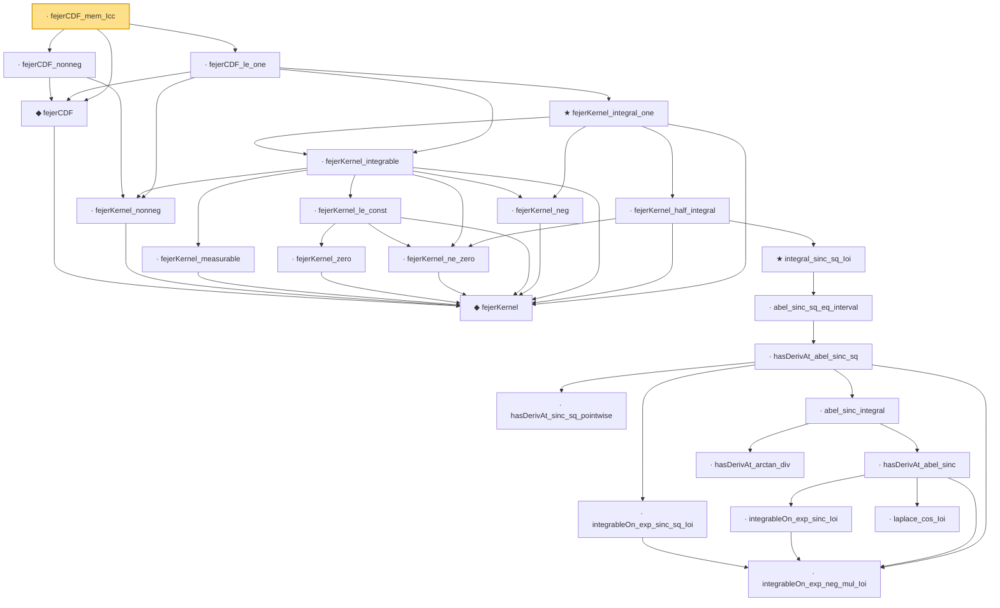

# Proof narrative — fejerCDF_mem_Icc

Root: **fejerCDF_mem_Icc** (lemma) `Statlib/Fourier/fejerCDF_mem_Icc.lean:11` · topic `Fourier`
Closure: 25 declarations across 25 files. Generated from `proof_graph.json` — no files were moved.

Reading order (foundations first, headline last):

    ◆ `fejerKernel` — noncomputable def · `Statlib/Fourier/fejerKernel.lean:9`  _(also used by 10: cesaro_cos_eq_fejerKernel, fejerCDF_symm, fejerCDF_tail_bound, …)_
  ◆ `fejerCDF` — noncomputable def · `Statlib/Fourier/fejerCDF.lean:11`  _(also used by 16: fejerCDF_eq_cesaro, fejerCDF_monotone, fejerCDF_symm, …)_
    · `fejerKernel_nonneg` — lemma · `Statlib/Fourier/fejerKernel_nonneg.lean:9`  _(also used by 3: fejerCDF_monotone, esseen_smoothing_ineq, fejerCDF_density_bound)_
  · `fejerCDF_nonneg` — lemma · `Statlib/Fourier/fejerCDF_nonneg.lean:10`  _(also used by 2: fejerCDF_bracket_upper, integrable_fejerCDF_sub)_
        · `fejerKernel_measurable` — lemma · `Statlib/Fourier/fejerKernel_measurable.lean:9`  _(also used by 2: fejerCDF_density_bound, fejer_kernel_cdf_identity)_
          · `fejerKernel_zero` — lemma · `Statlib/Fourier/fejerKernel_zero.lean:8`  _(also used by 1: cesaro_cos_eq_fejerKernel)_
        · `fejerKernel_ne_zero` — lemma · `Statlib/Fourier/fejerKernel_ne_zero.lean:8`  _(also used by 3: cesaro_cos_eq_fejerKernel, fejerCDF_tail_bound, fejerKernel_eq_ae)_
        · `fejerKernel_le_const` — lemma · `Statlib/Fourier/fejerKernel_le_const.lean:11`
      · `fejerKernel_neg` — lemma · `Statlib/Fourier/fejerKernel_neg.lean:9`  _(also used by 2: fejerCDF_symm, esseen_smoothing_ineq)_
    · `fejerKernel_integrable` — lemma · `Statlib/Fourier/fejerKernel_integrable.lean:14`  _(also used by 7: fejerCDF_monotone, fejerCDF_symm, fejerCDF_tail_bound, …)_
            · `integrableOn_exp_neg_mul_Ioi` — lemma · `Statlib/Fourier/integrableOn_exp_neg_mul_Ioi.lean:7`  _(also used by 2: hasDerivAt_abel_sinc, integrableOn_exp_sinc_Ioi)_
            · `integrableOn_exp_sinc_sq_Ioi` — lemma · `Statlib/Fourier/integrableOn_exp_sinc_sq_Ioi.lean:9`
            · `hasDerivAt_sinc_sq_pointwise` — lemma · `Statlib/Fourier/hasDerivAt_sinc_sq_pointwise.lean:7`
            · `integrableOn_exp_sinc_Ioi` — lemma · `Statlib/Fourier/integrableOn_exp_sinc_Ioi.lean:8`  _(also used by 1: hasDerivAt_abel_sinc)_
            · `laplace_cos_Ioi` — lemma · `Statlib/Fourier/laplace_cos_Ioi.lean:9`  _(also used by 1: hasDerivAt_abel_sinc)_
            · `hasDerivAt_abel_sinc` — lemma · `Statlib/Fourier/hasDerivAt_abel_sinc.lean:12`  _(also used by 1: abel_sinc_integral)_
            · `hasDerivAt_arctan_div` — lemma · `Statlib/Fourier/hasDerivAt_arctan_div.lean:7`  _(also used by 1: abel_sinc_integral)_
            · `abel_sinc_integral` — lemma · `Statlib/Fourier/abel_sinc_integral.lean:15`
            · `hasDerivAt_abel_sinc_sq` — lemma · `Statlib/Fourier/hasDerivAt_abel_sinc_sq.lean:13`
          · `abel_sinc_sq_eq_interval` — lemma · `Statlib/Fourier/abel_sinc_sq_eq_interval.lean:13`
        ★ `integral_sinc_sq_Ioi` — theorem · `Statlib/Fourier/integral_sinc_sq_Ioi.lean:10`
      · `fejerKernel_half_integral` — lemma · `Statlib/Fourier/fejerKernel_half_integral.lean:13`
    ★ `fejerKernel_integral_one` — theorem · `Statlib/Fourier/fejerKernel_integral_one.lean:16`  _(also used by 4: fejerCDF_symm, fejerCDF_tail_bound, esseen_smoothing_ineq, …)_
  · `fejerCDF_le_one` — lemma · `Statlib/Fourier/fejerCDF_le_one.lean:12`  _(also used by 3: fejerCDF_bracket_lower, fejerCDF_bracket_upper, integrable_fejerCDF_sub)_
· `fejerCDF_mem_Icc` — lemma · `Statlib/Fourier/fejerCDF_mem_Icc.lean:11` **← headline**

## Dependency diagram

