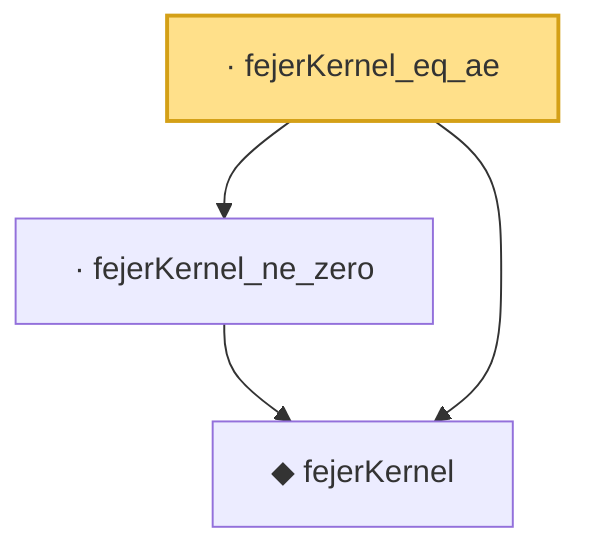

# Proof narrative — fejerKernel_eq_ae

Root: **fejerKernel_eq_ae** (lemma) `Statlib/Fourier/fejerKernel_eq_ae.lean:10` · topic `Fourier`
Closure: 3 declarations across 3 files. Generated from `proof_graph.json` — no files were moved.

Reading order (foundations first, headline last):

  ◆ `fejerKernel` — noncomputable def · `Statlib/Fourier/fejerKernel.lean:9`  _(also used by 18: cesaro_cos_eq_fejerKernel, fejerCDF, fejerCDF_symm, …)_
  · `fejerKernel_ne_zero` — lemma · `Statlib/Fourier/fejerKernel_ne_zero.lean:8`  _(also used by 5: cesaro_cos_eq_fejerKernel, fejerCDF_tail_bound, fejerKernel_half_integral, …)_
· `fejerKernel_eq_ae` — lemma · `Statlib/Fourier/fejerKernel_eq_ae.lean:10` **← headline**

## Dependency diagram

