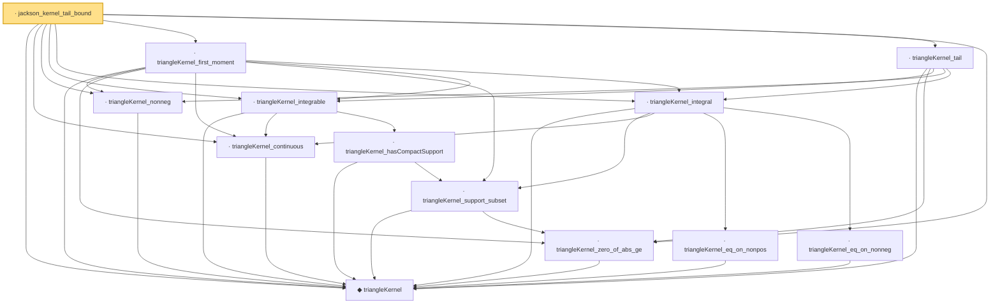

# Proof narrative — jackson_kernel_tail_bound

Root: **jackson_kernel_tail_bound** (lemma) `Statlib/Fourier/jackson_kernel_tail_bound.lean:32` · topic `Fourier`
Closure: 13 declarations across 13 files. Generated from `proof_graph.json` — no files were moved.

Reading order (foundations first, headline last):

  ◆ `triangleKernel` — noncomputable def · `Statlib/Fourier/triangleKernel.lean:7`  _(also used by 2: sinc4Kernel, sinc4Kernel_eq)_
  · `triangleKernel_continuous` — lemma · `Statlib/Fourier/triangleKernel_continuous.lean:8`  _(also used by 1: sinc4Kernel_integrable)_
  · `triangleKernel_nonneg` — lemma · `Statlib/Fourier/triangleKernel_nonneg.lean:8`  _(also used by 1: sinc4Kernel_nonneg)_
  · `triangleKernel_zero_of_abs_ge` — lemma · `Statlib/Fourier/triangleKernel_zero_of_abs_ge.lean:8`  _(also used by 1: sinc4Kernel_zero_of_abs_ge)_
    · `triangleKernel_support_subset` — lemma · `Statlib/Fourier/triangleKernel_support_subset.lean:9`
    · `triangleKernel_hasCompactSupport` — lemma · `Statlib/Fourier/triangleKernel_hasCompactSupport.lean:9`  _(also used by 1: sinc4Kernel_integrable)_
  · `triangleKernel_integrable` — lemma · `Statlib/Fourier/triangleKernel_integrable.lean:10`  _(also used by 1: sinc4Kernel_integral)_
    · `triangleKernel_eq_on_nonpos` — lemma · `Statlib/Fourier/triangleKernel_eq_on_nonpos.lean:8`
    · `triangleKernel_eq_on_nonneg` — lemma · `Statlib/Fourier/triangleKernel_eq_on_nonneg.lean:8`
  · `triangleKernel_integral` — lemma · `Statlib/Fourier/triangleKernel_integral.lean:13`  _(also used by 1: sinc4Kernel_integral)_
  · `triangleKernel_first_moment` — lemma · `Statlib/Fourier/triangleKernel_first_moment.lean:14`
  · `triangleKernel_tail` — lemma · `Statlib/Fourier/triangleKernel_tail.lean:12`
· `jackson_kernel_tail_bound` — lemma · `Statlib/Fourier/jackson_kernel_tail_bound.lean:32` **← headline**

## Dependency diagram

