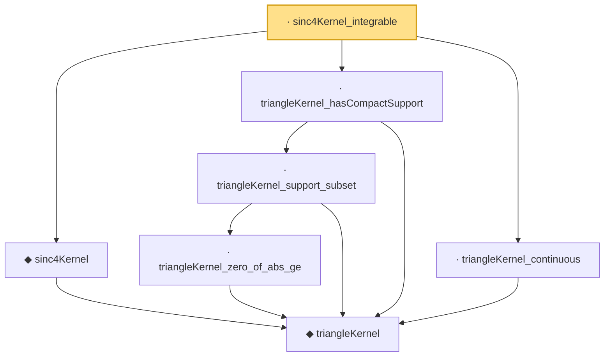

# Proof narrative — sinc4Kernel_integrable

Root: **sinc4Kernel_integrable** (lemma) `Statlib/Fourier/sinc4Kernel_integrable.lean:11` · topic `Fourier`
Closure: 7 declarations across 7 files. Generated from `proof_graph.json` — no files were moved.

Reading order (foundations first, headline last):

    ◆ `triangleKernel` — noncomputable def · `Statlib/Fourier/triangleKernel.lean:7`  _(also used by 9: jackson_kernel_tail_bound, sinc4Kernel_eq, triangleKernel_eq_on_nonneg, …)_
  ◆ `sinc4Kernel` — noncomputable def · `Statlib/Fourier/sinc4Kernel.lean:9`  _(also used by 4: sinc4Kernel_eq, sinc4Kernel_integral, sinc4Kernel_nonneg, …)_
      · `triangleKernel_zero_of_abs_ge` — lemma · `Statlib/Fourier/triangleKernel_zero_of_abs_ge.lean:8`  _(also used by 4: jackson_kernel_tail_bound, sinc4Kernel_zero_of_abs_ge, triangleKernel_first_moment, …)_
    · `triangleKernel_support_subset` — lemma · `Statlib/Fourier/triangleKernel_support_subset.lean:9`  _(also used by 2: triangleKernel_first_moment, triangleKernel_integral)_
  · `triangleKernel_hasCompactSupport` — lemma · `Statlib/Fourier/triangleKernel_hasCompactSupport.lean:9`  _(also used by 1: triangleKernel_integrable)_
  · `triangleKernel_continuous` — lemma · `Statlib/Fourier/triangleKernel_continuous.lean:8`  _(also used by 4: jackson_kernel_tail_bound, triangleKernel_first_moment, triangleKernel_integrable, …)_
· `sinc4Kernel_integrable` — lemma · `Statlib/Fourier/sinc4Kernel_integrable.lean:11` **← headline**

## Dependency diagram

