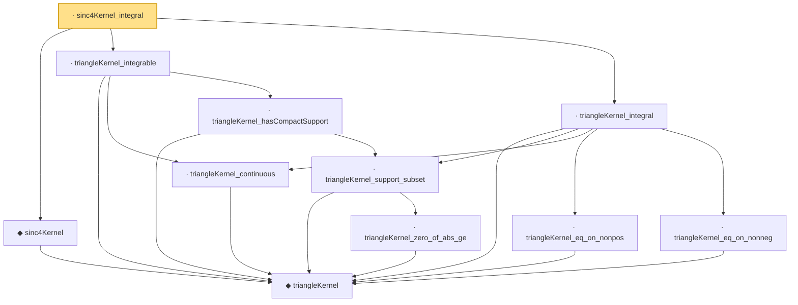

# Proof narrative — sinc4Kernel_integral

Root: **sinc4Kernel_integral** (lemma) `Statlib/Fourier/sinc4Kernel_integral.lean:11` · topic `Fourier`
Closure: 11 declarations across 11 files. Generated from `proof_graph.json` — no files were moved.

Reading order (foundations first, headline last):

    ◆ `triangleKernel` — noncomputable def · `Statlib/Fourier/triangleKernel.lean:7`  _(also used by 5: jackson_kernel_tail_bound, sinc4Kernel_eq, triangleKernel_first_moment, …)_
  ◆ `sinc4Kernel` — noncomputable def · `Statlib/Fourier/sinc4Kernel.lean:9`  _(also used by 4: sinc4Kernel_eq, sinc4Kernel_integrable, sinc4Kernel_nonneg, …)_
    · `triangleKernel_continuous` — lemma · `Statlib/Fourier/triangleKernel_continuous.lean:8`  _(also used by 3: jackson_kernel_tail_bound, sinc4Kernel_integrable, triangleKernel_first_moment)_
        · `triangleKernel_zero_of_abs_ge` — lemma · `Statlib/Fourier/triangleKernel_zero_of_abs_ge.lean:8`  _(also used by 4: jackson_kernel_tail_bound, sinc4Kernel_zero_of_abs_ge, triangleKernel_first_moment, …)_
    · `triangleKernel_support_subset` — lemma · `Statlib/Fourier/triangleKernel_support_subset.lean:9`  _(also used by 1: triangleKernel_first_moment)_
    · `triangleKernel_hasCompactSupport` — lemma · `Statlib/Fourier/triangleKernel_hasCompactSupport.lean:9`  _(also used by 1: sinc4Kernel_integrable)_
  · `triangleKernel_integrable` — lemma · `Statlib/Fourier/triangleKernel_integrable.lean:10`  _(also used by 3: jackson_kernel_tail_bound, triangleKernel_first_moment, triangleKernel_tail)_
    · `triangleKernel_eq_on_nonpos` — lemma · `Statlib/Fourier/triangleKernel_eq_on_nonpos.lean:8`
    · `triangleKernel_eq_on_nonneg` — lemma · `Statlib/Fourier/triangleKernel_eq_on_nonneg.lean:8`
  · `triangleKernel_integral` — lemma · `Statlib/Fourier/triangleKernel_integral.lean:13`  _(also used by 3: jackson_kernel_tail_bound, triangleKernel_first_moment, triangleKernel_tail)_
· `sinc4Kernel_integral` — lemma · `Statlib/Fourier/sinc4Kernel_integral.lean:11` **← headline**

## Dependency diagram

