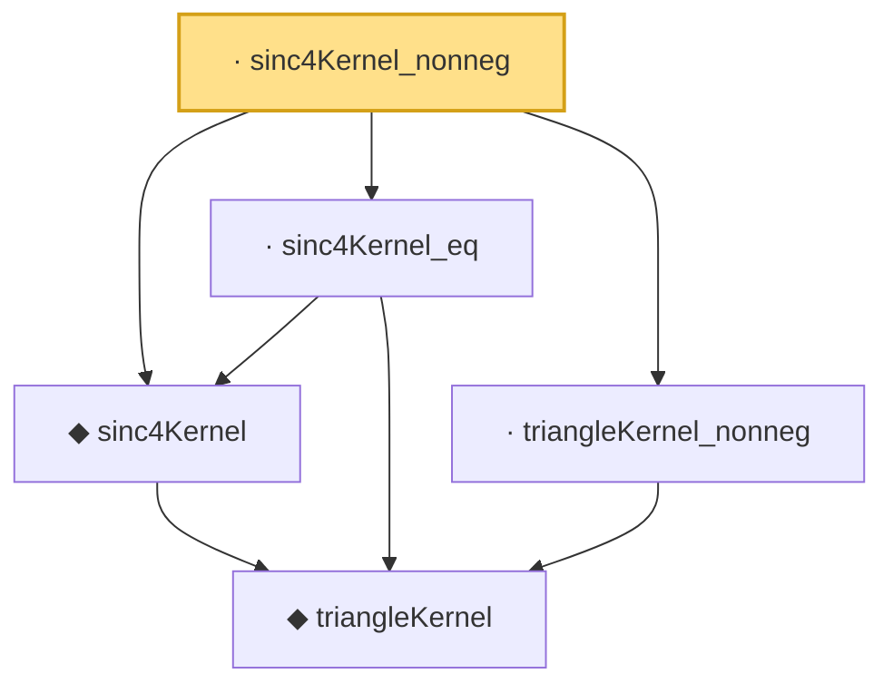

# Proof narrative — sinc4Kernel_nonneg

Root: **sinc4Kernel_nonneg** (lemma) `Statlib/Fourier/sinc4Kernel_nonneg.lean:11` · topic `Fourier`
Closure: 5 declarations across 5 files. Generated from `proof_graph.json` — no files were moved.

Reading order (foundations first, headline last):

    ◆ `triangleKernel` — noncomputable def · `Statlib/Fourier/triangleKernel.lean:7`  _(also used by 11: jackson_kernel_tail_bound, triangleKernel_continuous, triangleKernel_eq_on_nonneg, …)_
  ◆ `sinc4Kernel` — noncomputable def · `Statlib/Fourier/sinc4Kernel.lean:9`  _(also used by 3: sinc4Kernel_integrable, sinc4Kernel_integral, sinc4Kernel_zero_of_abs_ge)_
  · `sinc4Kernel_eq` — lemma · `Statlib/Fourier/sinc4Kernel_eq.lean:9`  _(also used by 1: sinc4Kernel_zero_of_abs_ge)_
  · `triangleKernel_nonneg` — lemma · `Statlib/Fourier/triangleKernel_nonneg.lean:8`  _(also used by 3: jackson_kernel_tail_bound, triangleKernel_first_moment, triangleKernel_tail)_
· `sinc4Kernel_nonneg` — lemma · `Statlib/Fourier/sinc4Kernel_nonneg.lean:11` **← headline**

## Dependency diagram

