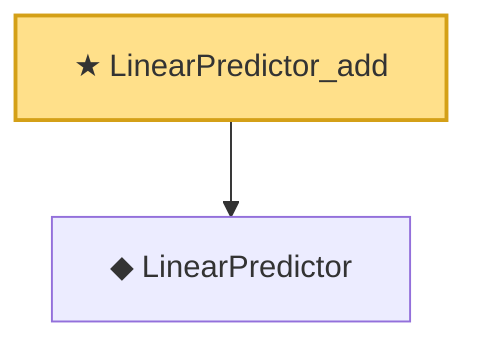

# Proof narrative — LinearPredictor_add

Root: **LinearPredictor_add** (theorem) `Statlib/GLM/LinearPredictor_add.lean:10` · topic `GLM`
Closure: 2 declarations across 2 files. Generated from `proof_graph.json` — no files were moved.

Reading order (foundations first, headline last):

  ◆ `LinearPredictor` — def · `Statlib/GLM/LinearPredictor.lean:10`  _(also used by 3: LinearPredictor_smul, LinearPredictor_zero, predictedMean)_
★ `LinearPredictor_add` — theorem · `Statlib/GLM/LinearPredictor_add.lean:10` **← headline**

## Dependency diagram

