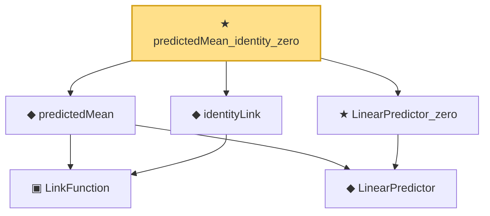

# Proof narrative — predictedMean_identity_zero

Root: **predictedMean_identity_zero** (theorem) `Statlib/GLM/predictedMean_identity_zero.lean:14` · topic `GLM`
Closure: 6 declarations across 6 files. Generated from `proof_graph.json` — no files were moved.

Reading order (foundations first, headline last):

    ▣ `LinkFunction` — structure · `Statlib/GLM/LinkFunction.lean:22`
    ◆ `LinearPredictor` — def · `Statlib/GLM/LinearPredictor.lean:10`  _(also used by 2: LinearPredictor_add, LinearPredictor_smul)_
  ◆ `predictedMean` — def · `Statlib/GLM/predictedMean.lean:11`
  ◆ `identityLink` — def · `Statlib/GLM/identityLink.lean:10`
  ★ `LinearPredictor_zero` — theorem · `Statlib/GLM/LinearPredictor_zero.lean:12`
★ `predictedMean_identity_zero` — theorem · `Statlib/GLM/predictedMean_identity_zero.lean:14` **← headline**

## Dependency diagram

