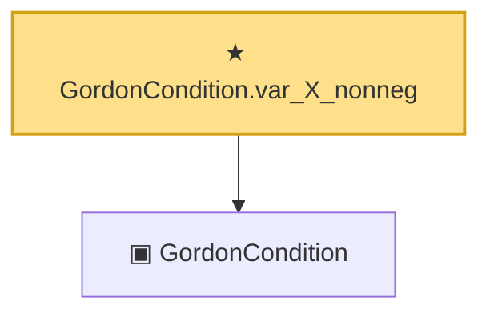

# Proof narrative — GordonCondition.var_X_nonneg

Root: **GordonCondition.var_X_nonneg** (theorem) `Statlib/Gaussian/Gordon.lean:233` · topic `Gaussian`
Closure: 2 declarations across 1 files. Generated from `proof_graph.json` — no files were moved.

Reading order (foundations first, headline last):

  ▣ `GordonCondition` — structure · `Statlib/Gaussian/Gordon.lean:165`  _(also used by 8: GordonCondition.refl, gordonCondition_of_independent, GordonCondition.var_eq_symm, …)_
★ `GordonCondition.var_X_nonneg` — theorem · `Statlib/Gaussian/Gordon.lean:233` **← headline**

## Dependency diagram

