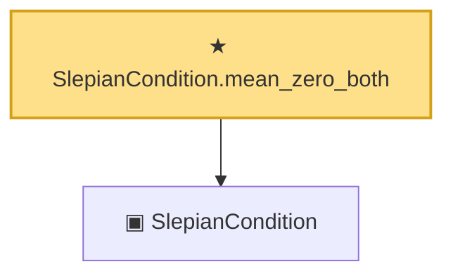

# Proof narrative — SlepianCondition.mean_zero_both

Root: **SlepianCondition.mean_zero_both** (theorem) `Statlib/Gaussian/Gordon.lean:96` · topic `Gaussian`
Closure: 2 declarations across 1 files. Generated from `proof_graph.json` — no files were moved.

Reading order (foundations first, headline last):

  ▣ `SlepianCondition` — structure · `Statlib/Gaussian/Gordon.lean:40`  _(also used by 6: SlepianCondition.symm_cov_le, SlepianCondition.refl, SlepianCondition.var_eq_symm, …)_
★ `SlepianCondition.mean_zero_both` — theorem · `Statlib/Gaussian/Gordon.lean:96` **← headline**

## Dependency diagram

