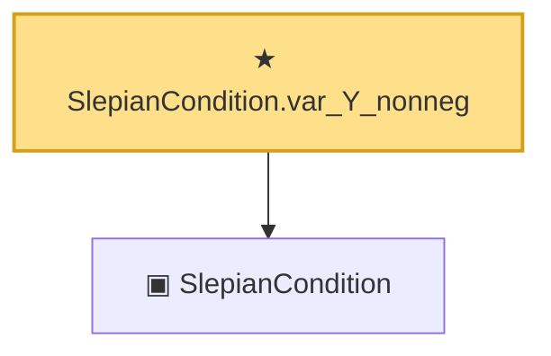

# Proof narrative — SlepianCondition.var_Y_nonneg

Root: **SlepianCondition.var_Y_nonneg** (theorem) `Statlib/Gaussian/Gordon.lean:121` · topic `Gaussian`
Closure: 2 declarations across 1 files. Generated from `proof_graph.json` — no files were moved.

Reading order (foundations first, headline last):

  ▣ `SlepianCondition` — structure · `Statlib/Gaussian/Gordon.lean:40`  _(also used by 6: SlepianCondition.symm_cov_le, SlepianCondition.refl, SlepianCondition.mean_zero_both, …)_
★ `SlepianCondition.var_Y_nonneg` — theorem · `Statlib/Gaussian/Gordon.lean:121` **← headline**

## Dependency diagram

