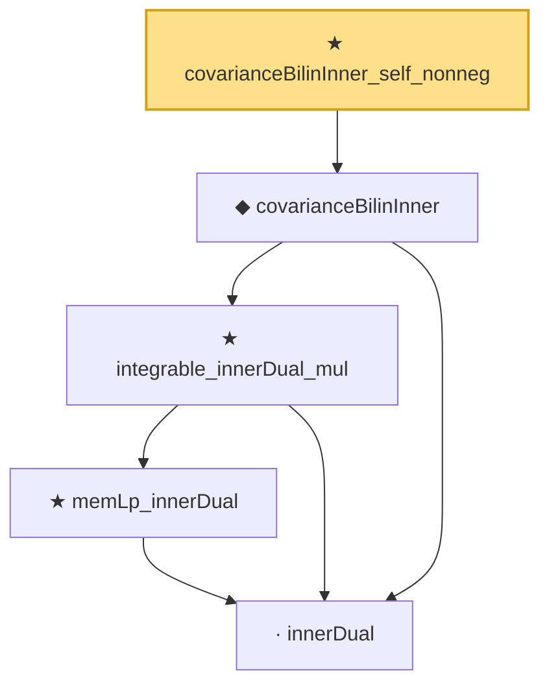

# Proof narrative — covarianceBilinInner_self_nonneg

Root: **covarianceBilinInner_self_nonneg** (theorem) `Statlib/Gaussian/HilbertSpace.lean:216` · topic `Gaussian`
Closure: 5 declarations across 1 files. Generated from `proof_graph.json` — no files were moved.

Reading order (foundations first, headline last):

    · `innerDual` — private noncomputable def · `Statlib/Gaussian/HilbertSpace.lean:166`  _(also used by 2: integrable_innerDual, covarianceBilinInner_self_eq_variance)_
      ★ `memLp_innerDual` — private theorem · `Statlib/Gaussian/HilbertSpace.lean:170`  _(also used by 2: integrable_innerDual, covarianceBilinInner_self_eq_variance)_
    ★ `integrable_innerDual_mul` — private theorem · `Statlib/Gaussian/HilbertSpace.lean:180`
  ◆ `covarianceBilinInner` — noncomputable def · `Statlib/Gaussian/HilbertSpace.lean:187`  _(also used by 2: covarianceBilinInner_comm, covarianceBilinInner_self_eq_variance)_
★ `covarianceBilinInner_self_nonneg` — theorem · `Statlib/Gaussian/HilbertSpace.lean:216` **← headline**

## Dependency diagram

