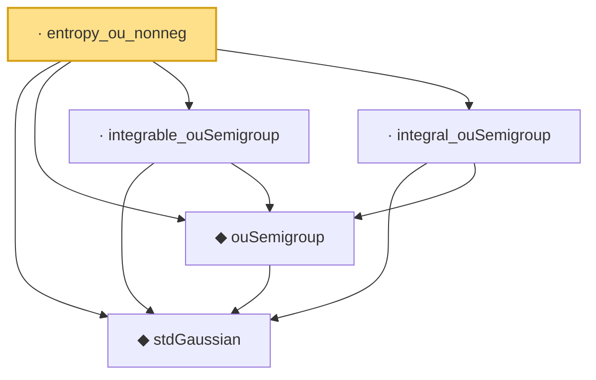

# Proof narrative — entropy_ou_nonneg

Root: **entropy_ou_nonneg** (private lemma) `Statlib/Gaussian/OrnsteinUhlenbeck.lean:2768` · topic `Gaussian`
Closure: 5 declarations across 2 files. Generated from `proof_graph.json` — no files were moved.

Reading order (foundations first, headline last):

  ◆ `stdGaussian` — abbrev · `Statlib/Gaussian/Basic.lean:29`  _(also used by 94: TensorizationLSIAt, stdGaussianPi, stdGaussianPi_absolutelyContinuous, …)_
  ◆ `ouSemigroup` — def · `Statlib/Gaussian/OrnsteinUhlenbeck.lean:42`  _(also used by 33: ouSemigroup_bound_norm, ouSemigroup_stein_repr, ouSemigroup_hasSecondDeriv, …)_
  · `integrable_ouSemigroup` — private lemma · `Statlib/Gaussian/OrnsteinUhlenbeck.lean:874`  _(also used by 4: integrable_one_add_log_ouSemigroup, entropy_dissipation, fisherInfo_ouSemigroup_le, …)_
  · `integral_ouSemigroup` — lemma · `Statlib/Gaussian/OrnsteinUhlenbeck.lean:62`  _(also used by 3: ouSemigroup_sq_integral_le, ouSemigroup_sq_integral_le_of_measurable, fisherInfo_ouSemigroup_le)_
· `entropy_ou_nonneg` — private lemma · `Statlib/Gaussian/OrnsteinUhlenbeck.lean:2768` **← headline**

## Dependency diagram

